# Biokube Developer Docs

The <b>Biokube Developr Docs</b> contains the information that a developer would
like to know about the internals of the <b>Biokube</b> platform. <br>

- What are it's moving parts ?
- How is it setup ?
- What is the purpose of each of its components ?
- How is everything connected ?
- What libraries are used and why ?
- How can I customize the platform ?
- ...

## Setup OS

The recommended Operating System for <b>Biokube</b> development is Mac OSX. The
reason for this is that <b>Biokube</b> ships with
[React Native](https://reactnative.dev/) which requires Xcode to build iOS
apps.<br> So if you use <b>Biokube</b> to build apps for Apple iOS using React
Native, you definately need a [Mac](https://www.apple.com/mac/).<br>
<b>Biokube</b> also allows for prototyping with <b>Framer</b>. Framer comes in
two versions:

- [Framer Desktop](https://www.framer.com/desktop/)
- [Framer Web](https://www.framer.com/).

Framer Desktop only runs on a Mac. You can use <b>Biokube</b> with Linux (
[Pop!\_OS](https://pop.system76.com/) ,
[Ubuntu Desktop](https://ubuntu.com/download/desktop) ) but with two
restrictions:

- Mobile app development with React Native only for Android
- Prototype using Framer Web instead of Framer Desktop

## Setup Docker

Virtualization Technology enables running multiple Virtual machines on a single
Physical machine. In it's first generation, only the hardware layer was
virtualized. As a result, every Virtual Machine (VM) required it's own Operating
System (OS) which takes time to boot and results in large VM images...
[VMware](https://www.vmware.com/products/personal-desktop-virtualization.html)
is a popular first generation Virtualization Technology.<br>

Second generation Virtualization Technology not only virtualizes the hardware
layer, but also the operating system layer. As a result every "Virtual Machine"
(called a <b>Container</b>) boots only it's own process, not it's own operating
system. That's why containers achieve sub-second boot times and can be small in
size. The operating system (kernel) on the host is already booted and
provisioned for all containers launched on that host.

[Docker](https://www.docker.com/get-started) is a second generation
Virtualization Technology. In 2013, Docker introduced what would become the
industry standard for containers. Containers are a standardized unit of software
that allows developers to isolate their app from its environment, solving the
“it works on my machine” headache. For millions of developers today, Docker is
the de facto standard to build and share containerized apps - from desktop, to
the cloud.

<b>Biokube</b> deploys to kubernetes. Therefore we need first class kubernetes
support during development, which is achieved by running [K3D](https://k3d.io/)
which requires a recent version of Docker installed. Additionally we'll also
install a convenient Visual Docker container management tool named
[Portainer](https://www.portainer.io/) to visually and interact with our Docker
containers during development.

### 1\. Install Docker

<code>`sudo apt update`</code><br> Downloads package information on updated
versions of packages or their dependencies from all configured `sources`
(defined in `/etc/apt/sources.list` and `/etc/apt/sources.list.d/`)

<code>`sudo apt install apt-transport-https ca-certificates curl software-properties-common`</code><br>
Installs these packages from any "known" configured `sources`

<code>`curl -fsSL https://download.docker.com/linux/ubuntu/gpg | sudo apt-key add -`</code><br>
Downloads PGP public key, used by `apt` to authenticate packages from this
hosted package repository, and adds it to the list of trusted keys
(`apt-key list`)

<code>`sudo add-apt-repository "deb [arch=amd64] https://download.docker.com/linux/ubuntu focal stable"`</code><br>
Adds this hosted package repository to `/etc/apt/sources.list` or
`/etc/apt/sources.list.d`

<code>`sudo apt update`</code><br> Since we just added a new package repository
we need to get the latest information for updated package versions and
dependencies.

<code>`apt-cache policy docker-ce`</code><br> Shows which versions of this
package are available from which repo at which priority.

<code>`sudo apt install docker-ce`</code><br> Installs `docker` on your system.

<code>`sudo systemctl status docker`</code><br> Shows `systemd docker.service`
status information. Docker is installed as a `systemd service`.<br> The
fundamental purpose of an init system like `systemd` is to initialize the
components that must be started after the Linux kernel is booted (traditionally
known as “userland” components).<br> The init system is also used to manage
services and daemons for the server at any point while the system is running.

<code>`sudo usermod -aG docker ${USER}`</code><br> Adds the current user to the
`docker` group which has elevated priviledges so that you don't have to
`sudo docker`

<code>`docker ps`</code><br> Shows the list of running docker containers.

> 1\. Install Docker

```shell
sudo apt update
sudo apt install apt-transport-https ca-certificates curl software-properties-common
curl -fsSL https://download.docker.com/linux/ubuntu/gpg | sudo apt-key add -
sudo add-apt-repository "deb [arch=amd64] https://download.docker.com/linux/ubuntu focal stable"
sudo apt update
apt-cache policy docker-ce
sudo apt install docker-ce
sudo systemctl enable docker && sudo systemctl status docker
sudo usermod -aG docker ${USER}
docker ps
```

### 2\. Login current user and show group membership for current user

<code>`su - ${USER}`</code><br> After installing `docker` you need to login
again to apply your updated group membership

<code>`id -nG`</code><br> Shows group membership for the current user.

> 2\. Login current user and show group membership for current user

```shell
su - ${USER}
id -nG
```

### 3\. Install Portainer

<code>`docker volume create portainer_data`</code><br> You’ll need to persist
Portainer data to keep your changes after restart/upgrade of the Portainer
container. This command creates a Docker volume to persist the Portainer data
inside the volume.

<code>`docker run -d -p 8000:8000 -p 9000:9000 --name=portainer --restart=always -v /var/run/docker.sock:/var/run/docker.sock -v portainer_data:/data portainer/portainer`</code><br>
Launches the Portainer container on your system.

> 3\. Install Portainer

```shell
docker volume create portainer_data
docker run -d -p 8000:8000 -p 9000:9000 --name=portainer --restart=always -v /var/run/docker.sock:/var/run/docker.sock -v portainer_data:/data portainer/portainer
```

After the container successfully launched, <b>Portainer</b> is served at
[http://localhost:9000](http://localhost:9000)

login = <code>admin</code><br> password = <code>the password set on first
use</code>

## Setup Cloud SDKs

### 1\. Install Google Cloud SDK

Add the Cloud SDK distribution URI as a package source

echo "deb [signed-by=/usr/share/keyrings/cloud.google.gpg]
http://packages.cloud.google.com/apt cloud-sdk main" | sudo tee -a
/etc/apt/sources.list.d/google-cloud-sdk.list

Import the Google Cloud Platform public key

curl https://packages.cloud.google.com/apt/doc/apt-key.gpg | sudo apt-key
--keyring /usr/share/keyrings/cloud.google.gpg add -

Update the package list and install the Cloud SDK

sudo apt-get update && sudo apt-get install google-cloud-sdk

gcloud auth login

### 2\. Install Azure CLI

curl -sL https://aka.ms/InstallAzureCLIDeb | sudo bash

sudo az login

### 3\. Install AWS CLI

<code>`curl "https://awscli.amazonaws.com/awscli-exe-linux-x86_64.zip" -o "awscliv2.zip"`</code>

<code>`unzip awscliv2.zip`</code>

<code>`sudo ./aws/install`</code>

## Setup Nodejs

<b>Biokube</b> uses [TypeScript](https://www.typescriptlang.org/) as the main
programming language for developing fullstack applications. With TypeScript, One
popular language can be used to develop the entire application stack. TypeScript
is compiled to JavaScript and it runs client side in the Browser, and server
side on [Node.JS](https://nodejs.org/en/). Node.JS uses the same V8 engine that
is used in Google Chrome. TypeScript can also be used for mobile app development
by leveraging facebook's React Native platform. Using One common language for
pragmatic fullstack, platform-agnostic application development enables
cross-stack-layer code reuse and requires less context switching inside the
human brain, wich all contributes to a better Developer Experience (DX).

Most of the build, test, lint, compile and bundle tooling required for
TypeScript/JavaScript application development relies on Node.JS and NPM (the
Node Package Manager) be correctly installed on your local development system.
We will use Node Version Manager to accomplish this. Node Version Manager or
<code>nvm</code> is a version manager for Node.JS and helps us to easily add,
remove and switch between different versions of Node.JS during development.

### 1\. Install NVM

<code>`curl https://raw.githubusercontent.com/creationix/nvm/master/install.sh | bash`</code><br>
Downloads and installs NVM

`.zshrc` is a shell script that <code>`zsh`</code> runs EVERY time it is started
interactively. It initializes an interactive shell session by running the
commands in this file.

<code>`echo 'export NVM_DIR="$HOME/.nvm"' >>~/.zshrc`</code><br> Appends this
line to `~/.zshrc` <br> This line Creates an environment variable `NVM_DIR` and
sets it's value to `~/.nvm` and exports the variable to the environment of all
the child processes running in the current shell.

<code>`echo '[ -s "$NVM_DIR/nvm.sh" ] && . $NVM_DIR/nvm.sh # This loads nvm' >>~/.zshrc`</code><br>
Appends this line to `~/.zshrc`

> 1\. Install NVM

```shell
curl https://raw.githubusercontent.com/creationix/nvm/master/install.sh | bash
```

### 2\. Edit ~/.zshrc

<code>.zshrc</code> is a shell script that <code>`zsh`</code> runs EVERY time it
is started interactively. It initializes an interactive shell session by running
the commands in this file.

<code>`nano ~/.zshrc`</code><br> Opens `~/.zshrc` file in `nano` texteditor.

Append the following lines to the end of this file:<br>
<code>`echo 'export NVM_DIR="$HOME/.nvm"' >>~/.zshrc`</code><br>
<code>`echo '[ -s "$NVM_DIR/nvm.sh" ] && . $NVM_DIR/nvm.sh # This loads nvm' >>~/.zshrc`</code>

> 2\. Edit ~/.zshrc

```shell
nano ~/.zshrc
export NVM_DIR="$HOME/.nvm"
[ -s "$NVM_DIR/nvm.sh" ] && \. "\$NVM_DIR/nvm.sh" # This loads nvm
```

### 3\. Find Available Node.js Versions

<code>`nvm ls-remote`</code>

> 3\. Find Available Node.js Versions

```shell
nvm ls-remote
```

### 4\. Install selected Node.js versions with NVM

<code>`nvm install v12.18.2`</code>

<code>`nvm install v14.5.0`</code>

> 4\. Installing selected Node.js versions with NVM

```shell
nvm install v12.18.2
nvm install v14.5.0
```

### 5\. Set Node.js Default version

<code>`nvm list`</code>

<code>`nvm use v12.18.2`</code>

<code>`node --version`</code>

> 5\. Set Node.js Default version

```shell
nvm list
nvm use v12.18.2
node --version
```

### 6\. Run Application with Specific Version

<code>`nvm run v12.18.2 app.js`</code>

> 6\. Run Application with Specific Version

```shell
nvm run v12.18.2 app.js
```

### 7\. Remove Unused Node.js Version

<code>`nvm list`</code>

<code>`nvm uninstall v4.9.1`</code>

> 7\. Remove Unused Node.js Version

```shell
nvm list
nvm uninstall v4.9.1
```

## Setup Yarn

Yarn is an alternative Node package manager to NPM built by Facebook. It is
considered faster in module delivery and more secure in its dependency
mamnagement. <br> Do not confuse it with Yarn 2 (which conceptually has a
totally different approach and is not backwards compatible wih Yarn).<br>
<b>biokube</b> uses <code>`yarn`</code> as default Node package manager.

### 1\. Install or update Yarn

<code>`curl --compressed -o- -L https://yarnpkg.com/install.sh | bash`</code>

> 1\. Install or update Yarn

```shell
curl --compressed -o- -L https://yarnpkg.com/install.sh | bash
```

### 2\. Uninstall Yarn

<code>`sudo apt purge yarn`</code> Remove Yarn and its dependencies

<code>`sudo rm /etc/apt/sources.list.d/yarn.list`</code> Remove the Yarn
repository from the repository list

<code>`sudo apt-key list`</code> Find the GPG key that was added to the trusted
keys. Look for <code>Yarn Packaging</code> to find the correct key in the list

<code>`sudo apt-key del 86E50310`</code> Use the last 8 characters of the GPG
key’s fingerprint in the line starting with <code>pub</code>

> 2\. Uninstall Yarn

```shell
sudo apt purge yarn
sudo rm /etc/apt/sources.list.d/yarn.list
sudo apt-key list
sudo apt-key del 86E50310
```

## Setup GitHub

By far, the most widely used modern version control system in the world today is
Git. Git is a mature, actively maintained open source project originally
developed in 2005 by Linus Torvalds, the famous creator of the Linux operating
system kernel. A staggering number of software projects rely on Git for version
control, including commercial projects as well as open source.

Having a distributed architecture, Git is an example of a DVCS ( Distributed
Version Control System ). Rather than have only one single place for the full
version history of the software, in Git, every developer's working copy of the
code is also a repository that can contain the full history of all changes.

[GitHub](https://github.com) is a the world's largest Git based DVCS in the
cloud, and the largest developer community platform in the world. GitHub hosts
your source code inside public or private repositories.

### 1\. Clone Biokube repository

Cloning a public code repository from GitHub does not require a Public/Private
keypair. So go ahead and clone the [biokube](https://github.com/bio8/biokube)
repository to a folder on your local machine.

<code>`git clone git@github.com:bio8/biokube.git`</code> Downloads the
<code>biokube</code> code repository to a folder on your disk.

> 1\. Clone Biokube repository

```shell
git clone git@github.com:bio8/biokube.git
```

### 2\. Create a Public/Private RSA keypair

In order to push and pull commits to and from GitHub you need a a Public/Private
keypair.

If you created a Public/Private RSA Keypair before it should be located
here:<br> Your personal Private key is stored in a file
<code>~/.ssh/id_rsa</code> and should have restricted filesystem permissions
<code>chmod 400</code><br> Your personal Public key is stored in a file
<code>~/.ssh/id_rsa.pub</code>

If you don't have a Public/Private RSA Keypair you can create one using OpenSSH

<code>`ssh-keygen -t rsa -b 2048`</code>

<code>`chmod 400 ~/.ssh/id_rsa`</code>

> 2\. Create a Public/Private RSA keypair

```shell
ssh-keygen -t rsa -b 2048
chmod 400 ~/.ssh/id_rsa
```

### 3\. Copy your public key to GitHub

The Public key of your personal Public/Private RSA Keypair is used by GitHub to
authenticate you when you try to interact with remote code repositories. <br> So
you need to hand-over your Public key to GitHub. To do that login to GitHub, and
in your GitHub account profile menu, click on <b>Settings</b> and then in the
left menu on <b>SSH and GPG keys</b>

[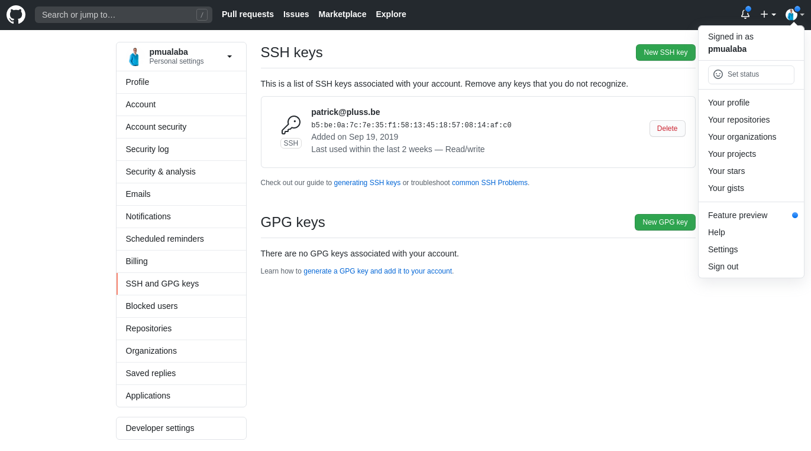](../images/github-add-ssh-key.png 'Click to enlarge')

Paste the contents of your <b>Public</b> key and give your SSH key a title.

[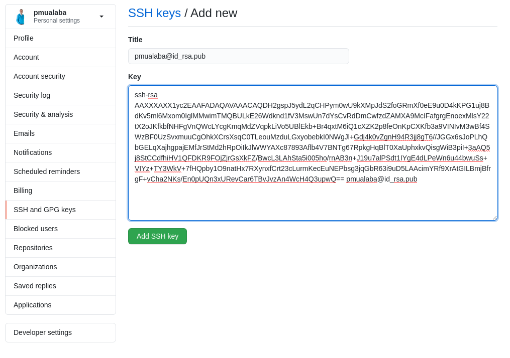](../images/github-add-ssh-key-new.png 'Click to enlarge')

Click on <code>Add SSH key</code>

### 4\. Create Remote GIT repository on Github

Since you don want to push your commits to the original remote repository (from
which you first cloned the contents to your local machine), you need to create a
new empty remote repository on GitHub which then will be linked to the local
repo.

Login to GitHub

[](../images/github-create-new-repository.png 'Click to enlarge')

Click on the <code>New</code> button

[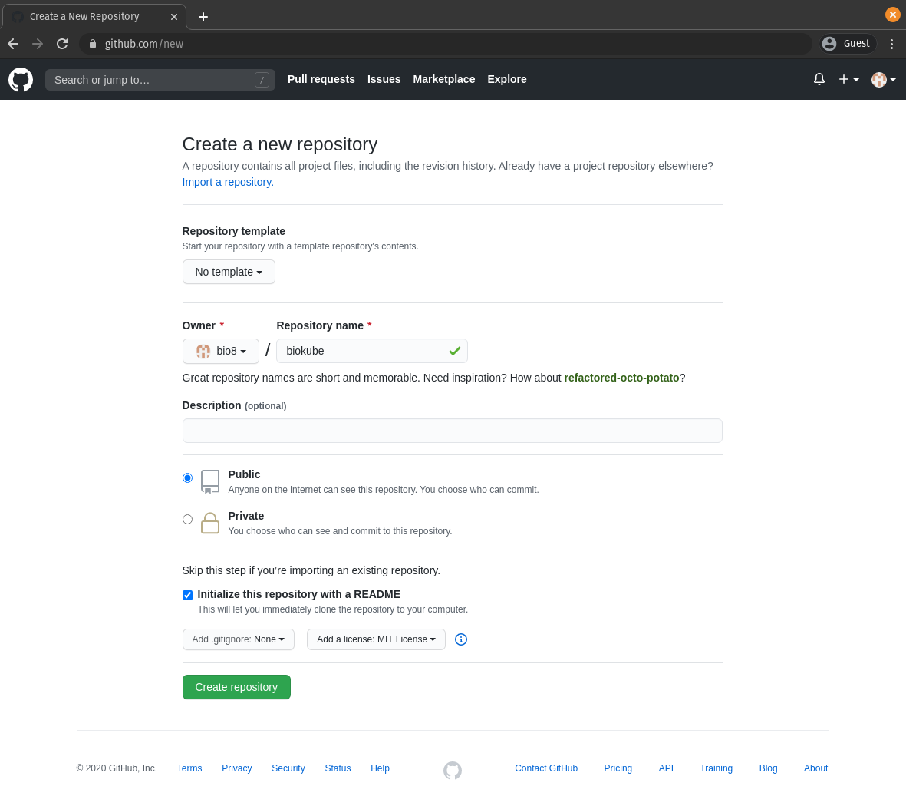](../images/github-create-new-public-repository.png 'Click to enlarge')

Click on <code>Create repository</code> button

### 5\. Link local existing GIT repository to remote existing GitHub repository

#### 5.1\. GitHub invite Collaborator

In order to be able to commit to a remote GitHub repository, you need to be the
creator/owner or a valid collaborator for this repository. If you manage
multiple Github accounts you can still commit and collaborate with one and the
same GitHub user account to multiple repositories over multiple GitHub accounts,
by inviting the GitHub user account as a collaborator for that repository.<br>
Just login to the GitHub account that hosts the repository you like to
collaborate to and invite your own Github user account to collaborate to that
repository. Click on <b>Settings</b> tab. Click on <b>Manage access</b> menu
item. Click on <b>Invite a collaborator</b> button

[](../images/github-manage-access.png 'Click to enlarge')

An Email will be sent to the mailbox associated with your own GitHub account.
Clicking on the <b>accept</b> link in the email will open a consent screen in
GitHub where you can accept the invite.

[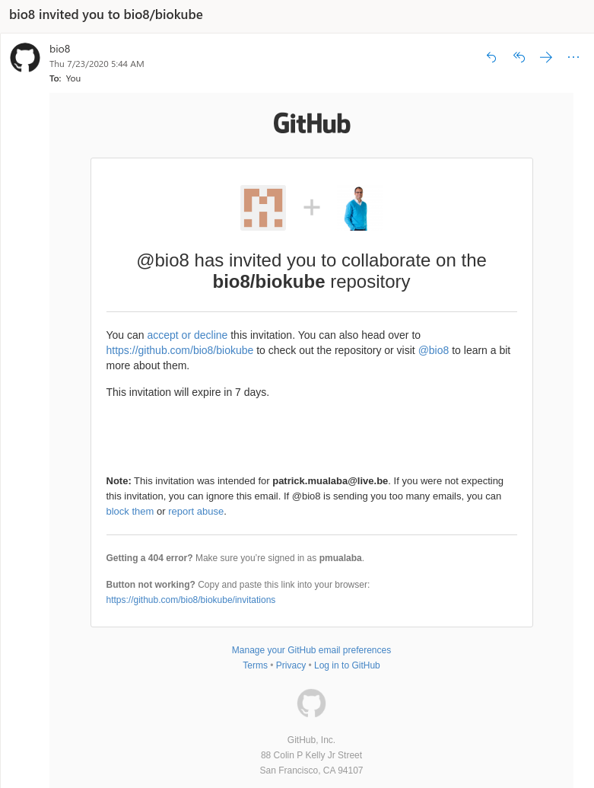](../images/github-invite-collaborator-email.png 'Click to enlarge')

[](../images/github-invite-collaborator-accept.png 'Click to enlarge')

#### 5.2\. Change <code>origin</code> of your GIT repository

Since you want to commit to another remote repository than the one you
originally cloned from, you need to change the origin of your local GIT
repository. You can do this with this set of <code>git</code> commands. <br> If
<code>origin</code> is not set in the local repo you may skip the command
<code>`git remote rm origin`</code>.

<code>`git remote show origin`</code>

<code>`git remote rm origin`</code>

<code>`git remote add origin git@github.com:<YOUR_GITHUB_ACCOUNT>/biokube.git`</code>

<code>`git config master.remote origin`</code>

<code>`git config master.merge refs/heads/master`</code>

<code>`git fetch`</code>

<code>`git branch --set-upstream-to=origin/master master`</code>

<code>`git pull origin master --allow-unrelated-histories`</code>

<code>`git push -u origin master`</code>

> 5.2\. Change <code>origin</code> of your GIT repository

```shell
git remote show origin
git remote rm origin
git remote add origin git@github.com:<YOUR_GITHUB_ACCOUNT>/biokube.git
git config master.remote origin
git config master.merge refs/heads/master
git fetch
git branch --set-upstream-to=origin/master master
git pull origin master --allow-unrelated-histories
git push -u origin master
```

## Setup Visual Studio Code

Visual Studio Code has rapidly become the most popular IDE for developers. It
loads projects fast and it is Free. It also has a nice extensions eco-system.
<br> <b>biokube</b> uses some convenient extensions to manage the platform and
to make the life of the developer easier.

- Nx Console Extension helps with organizing and running all build, serve, test
  and deploy tasks.
- Kubernetes Extension helps with writing and debugging helm templates
- Docker Extension shows an in-editor overview of your local Docker environment
  and its containers.

### 1\. Install Visual Studio Code

Download and install Visual Studio Code or Visual Studio Code Insiders (Canary)

[Download Visual Studio Code](https://code.visualstudio.com/insiders/)<br>
[Download Visual Studio Code Insiders](https://code.visualstudio.com/insiders/)

### 2\. Install Visual Studio Code Fonts

#### 2.1\. Install Terminal Nerd Font

Download and install (by double clicking) Nerd Font:

[MesloLGS NF Regular.ttf](https://github.com/romkatv/powerlevel10k-media/raw/master/MesloLGS%20NF%20Regular.ttf)<br>
[MesloLGS NF Bold.ttf](https://github.com/romkatv/powerlevel10k-media/raw/master/MesloLGS%20NF%20Bold.ttf)<br>
[MesloLGS NF Italic.ttf](https://github.com/romkatv/powerlevel10k-media/raw/master/MesloLGS%20NF%20Italic.ttf)<br>
[MesloLGS NF Bold Italic.ttf](https://github.com/romkatv/powerlevel10k-media/raw/master/MesloLGS%20NF%20Bold%20Italic.ttf)

#### 2.2\. Install Fira Code Font

<code>`sudo apt update && sudo apt install fonts-firacode`</code>

macOs
[https://github.com/tonsky/FiraCode/tree/master/distr/ttf](https://github.com/tonsky/FiraCode/tree/master/distr/ttf)

> 2.2\. Install Fira Code Font

```shell
sudo apt update && sudo apt install fonts-firacode
```

#### 2.3\. Configure Fonts in settings.json

Open File → Preferences → Settings and click on the icon

to toggle <code>settings.json</code> in code view.

[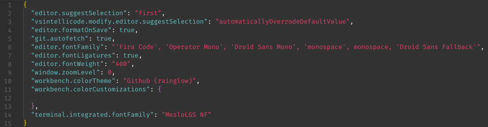](../images/vscode-settings-json.png 'Click to enlarge')

<code>
{<br>
  &emsp; "terminal.integrated.fontFamily": "MesloLGS NF"<br>
  &emsp; "editor.fontFamily": "'Fira Code', 'Operator Mono', 'Droid Sans Mono', 'monospace', monospace, 'Droid Sans Fallback'"<br>
}
</code>

> 2.3\. Configure Fonts in settings.json

```json
{
  "terminal.integrated.fontFamily": "MesloLGS NF",
  "editor.fontFamily": "'Fira Code', 'Operator Mono', 'Droid Sans Mono', 'monospace', monospace, 'Droid Sans Fallback'"
}
```

### 3\. Install Visual Studio Code Extensions

Install Your favorite Extensions:

[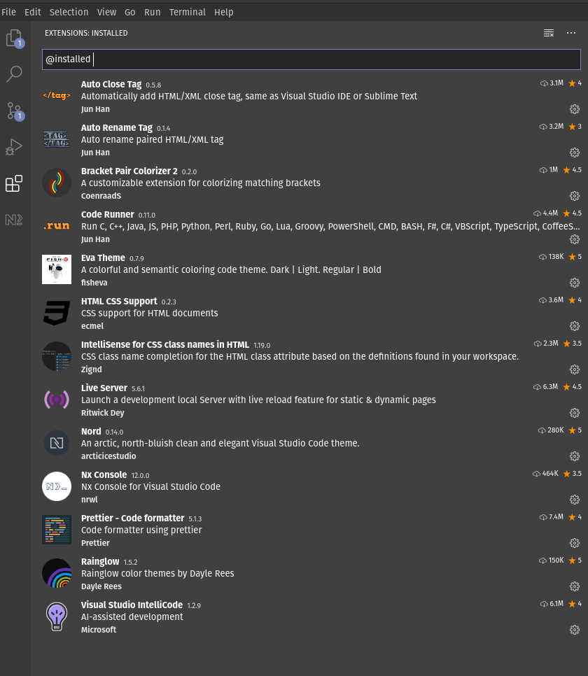](../images/vscode-extensions.png 'Click to enlarge')

### 4\. Install Oh My Zsh

If you want a good looking Terminal consider to install Oh My Zsh. It turns the
default Terminal into something like this:

[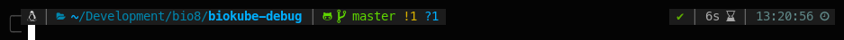](../images/vscode-oh-my-zsh.png 'Click to enlarge')

#### 4.1\. Install Oh My Zsh

<code>`sudo apt install zsh`</code>

<code>`sh -c "$(curl -fsSL https://raw.github.com/ohmyzsh/ohmyzsh/master/tools/install.sh)"`</code>

> 4.1\. Install Oh My Zsh

```shell
sudo apt install zsh
sh -c "$(curl -fsSL https://raw.github.com/ohmyzsh/ohmyzsh/master/tools/install.sh)"
```

#### 4.2\. Install Oh My Zsh powerlevel10k theme

<code>`git clone --depth=1 https://github.com/romkatv/powerlevel10k.git ${ZSH_CUSTOM:-$HOME/.oh-my-zsh/custom}/themes/powerlevel10k`</code>

> 4.2\. Install Oh My Zsh powerlevel10k theme

```shell
git clone --depth=1 https://github.com/romkatv/powerlevel10k.git ${ZSH_CUSTOM:-$HOME/.oh-my-zsh/custom}/themes/powerlevel10k
```

#### 4.3\. Install zsh autosuggestions

<code>`git clone https://github.com/zsh-users/zsh-autosuggestions ${ZSH_CUSTOM:-~/.oh-my-zsh/custom}/plugins/zsh-autosuggestions`</code>

> 4.3\. Install zsh autosuggestions

```shell
git clone https://github.com/zsh-users/zsh-autosuggestions ${ZSH_CUSTOM:-~/.oh-my-zsh/custom}/plugins/zsh-autosuggestions
```

#### 4.4\. Edit ~/.zshrc

<code>`nano ~/.zshrc`</code>

Edit the following settings:

<code>ZSH_THEME="powerlevel10k/powerlevel10k"</code><br> <code>plugins=(git
zsh-autosuggestions)</code>

> 4.4\. Edit ~/.zshrc

```shell
nano ~/.zshrc
ZSH_THEME="powerlevel10k/powerlevel10k"
plugins=(git zsh-autosuggestions)
```

Now Reboot to load the Fonts we installed (in Step 2).<br> Now when you open a
new terminal session the Oh My Zsh configuration wizard will be launched

#### 4.5\. Run the configuration wizard

You can always re-run the configuration wizard later with the following command:

<code>`p10k configure`</code>

> 4.5\. Run the configuration wizard

```shell
p10k configure
```

#### 4.6\. How to Update powerlevel10k to the latest version

<code>`git -C ${ZSH_CUSTOM:-$HOME/.oh-my-zsh/custom}/themes/powerlevel10k pull`</code>

> 4.6\. How to Update powerlevel10k to the latest version

```shell
git -C ${ZSH_CUSTOM:-$HOME/.oh-my-zsh/custom}/themes/powerlevel10k pull
```

#### 4.7\. How to Uninstall powerlevel10k

<code>`rm -rf -- ${ZSH_CUSTOM:-$HOME/.oh-my-zsh/custom}/themes/powerlevel10k`</code>

> 4.7\. How to Uninstall powerlevel10k

```shell
rm -rf -- ${ZSH_CUSTOM:-$HOME/.oh-my-zsh/custom}/themes/powerlevel10k
```

### 5\. Visual Studio Code shortcuts

Delete line: <code>`CTRL + SHIFT + K`</code><br> Move line up/down:
<code>`ALT + UP/DOWN`</code><br> Multicursor: Search a substring and then click
on 1 instance and press <code>`CTRL + SHIFT + L`</code><br> Open Command Panel:
<code>`CTRL + SHIFT + P`</code><br>

## Setup Nx Monorepo Workspace

<b>Biokube</b> is organized as a [Nx](https://nx.dev/react) Monorepo Workspace.
This enables a clean professional organized development codebase. Nx comes with
a powerful Nx CLI accompanied with a convenient Nx Console for Visual Studio
Code which helps with organizing and running all build, serve, test and deploy
tasks from one central panel in your IDE. If you like to know how the
<b>Biokube</b> Nx Monorepo Workspace was setup, just read on the following
sections...

### 1\. Install Nx CLI

<code>`sudo npm i -g @nrwl/cli`</code>

> 1\. Install Nx CLI

```shell
sudo npm i -g @nrwl/cli
```

### 2\. Create Biokube Nx Monorepo Workspace

First, an empty Nx Monorepo Workspace is created named <code>`biokube`</code>.
Then support is added for
[Next.js](https://nx.dev/react/plugins/next/overview#next-js-plugin) ,
[Nest.js](https://nx.dev/react/plugins/nest/overview#nest-plugin) and
[React Native](https://reactnative.dev/) applications

<code>`npx create-nx-workspace@latest biokube --preset=empty --cli=nx --skipGit=false --npm-scope=scope --nx-cloud=false`</code>
Creates an empty Nx Monorepo Workspace named <b>biokube</b>

<code>`yarn add -D @nrwl/nest`</code> Adds Nx support for Next.js

<code>`yarn add -D @nrwl/next`</code> Adds Nx support for Nest.js

<code>`yarn add -D @jbuijgers/nx-react-native`</code> Adds Nx support for React
Native

> 2\. Create Biokube Nx Monorepo Workspace

```shell
npx create-nx-workspace@latest biokube --preset=empty --cli=nx --skipGit=false --npm-scope=scope --nx-cloud=false
yarn add -D @nrwl/nest @nrwl/next
```

### 3\. Biokube Nx Applications and Libraries

Nx manages multiple projects in a single Git repository. This is called a
monorepo.<br> The <b>Biokube</b> monorepo consists of multiple - what Nx calls -
<b>projects</b> divided between <code>apps</code> and <code>libs</code>.<br> Nx
<code>apps</code> are deployable products that depend on multiple Nx
<code>libs</code> to build an entire application.

<b>Biokube</b> ships with the following Nx apps:

- biokube-api
- biokube-data
- biokube-web
- biokube-native
- biokube-docs

<code>biokube-api</code>, <code>biokube-data</code>, <code>biokube-web</code>
are Nx apps generated with <code>`nx generate @nrwl/nest:app`</code><br>
<code>biokube-native</code> is a Nx app that was generated with a community
generator<code>`nx generate @jbuijgers/nx-react-native:app`</code><br>
<code>biokube-docs</code> was not generated with <code>nx generate</code>, but
is added to the platform as a customized version of the popular
[slatedocs](https://github.com/slatedocs/slate) static documentation site
generator.<br>

The following <code>nx generate</code> commands were used to create the
<b>Biokube</b> Nx apps:

<code>`nx g @nrwl/nest:app biokube-api`</code>

<code>`nx g @nrwl/nest:app biokube-data`</code>

<code>`nx g @nrwl/next:app biokube-web --style="styled-components"`</code>

<code>`nx g @jbuijgers/nx-react-native:app`</code> Make sure to first finish
[Setup Biokube Native](/#setup-biokube-native) before running this
command.<br><br>

<b>Biokube</b> ships with the following Nx libs:

- cloud
- container
- data
- integration
- service
- types

The following <code>nx generate</code> commands were used to create the
<b>Biokube</b> Nx libs:

<code>`nx g @nrwl/node:lib cloud`</code>

<code>`nx g @nrwl/node:lib container`</code>

<code>`nx g @nrwl/node:lib data`</code>

<code>`nx g @nrwl/node:lib integration`</code>

<code>`nx g @nrwl/node:lib service`</code>

<code>`nx g @nrwl/node:lib types`</code><br><br>

<b>Biokube</b> ships with the following Nx UI libs:

- web
- native

The following <code>nx generate</code> commands were used to create the
<b>Biokube</b> Nx UI libs and <b>Biokube</b> UI components:

<code>`nx g @nrwl/next:lib blocks -d ui/web --pascalCaseFiles`</code><br>
<code>`nx g @nrwl/next:lib blocks -d ui/native --pascalCaseFiles`</code><br>

<code>`nx g @nrwl/next:lib elements -d ui/web --pascalCaseFiles`</code><br>
<code>`nx g @nrwl/next:lib elements -d ui/native --pascalCaseFiles`</code><br>

<code>`nx g @nrwl/next:component Button -p ui-native-elements -e`</code><br>
<code>`nx g @nrwl/next:component Button -p ui-web-elements -e`</code><br>

> 3\. Create Nx Biokube Applications and Libraries

```shell
nx g @nrwl/nest:app biokube-api
nx g @nrwl/nest:app biokube-data
nx g @nrwl/next:app biokube-web --style="styled-components"

nx g @nrwl/node:lib cloud
nx g @nrwl/node:lib container
nx g @nrwl/node:lib data
nx g @nrwl/node:lib integration
nx g @nrwl/node:lib service
nx g @nrwl/node:lib types

nx g @nrwl/next:lib blocks -d ui/web --pascalCaseFiles
nx g @nrwl/next:lib blocks -d ui/native --pascalCaseFiles

nx g @nrwl/next:lib elements -d ui/web --pascalCaseFiles
nx g @nrwl/next:lib elements -d ui/native --pascalCaseFiles

nx g @nrwl/next:component Button -p ui-web-elements -e
nx g @nrwl/next:component Button -p ui-native-elements -e
```

### 4\. Deleting a library

<code>`nx g @nrwl/node:remove service --forceRemove`</code> Deletes the service
library

> 4\. Deleting a library

```shell
nx g @nrwl/node:remove service --forceRemove
```

### 5\. Display Dependency Graph

An Nx workspace can contain dozens or hundreds of applications and libraries. As
a codebase grows, it can be difficult to understand how they depend on each
other and the implications of making a particular change. Previously, some
senior architect would create an ad-hoc dependency diagram and upload it to a
corporate wiki. The diagram is not correct even on Day 1 and gets more and more
out of sync with every passing day. With Nx advanced code analysis is used to
construct a visual dependency graph. Use the following command to display the
graph.

<code>`nx dep-graph`</code>

> 5\. Display Dependency Graph

```shell
nx dep-graph
```

### 6\. Nx Run Commands

You can execute <code>nx run</code> commands directly from the command line or
from the <b>Nx Console</b> Visual Studio Code Extension.<br> These commands are
managed, configured and customized under
<code>`project.<PROJECT_NAME>.architect`</code> keys in
<code>`workspace.json`</code>. This file is located in the root of your Nx
monorepo workspace.

Example workspace.json

[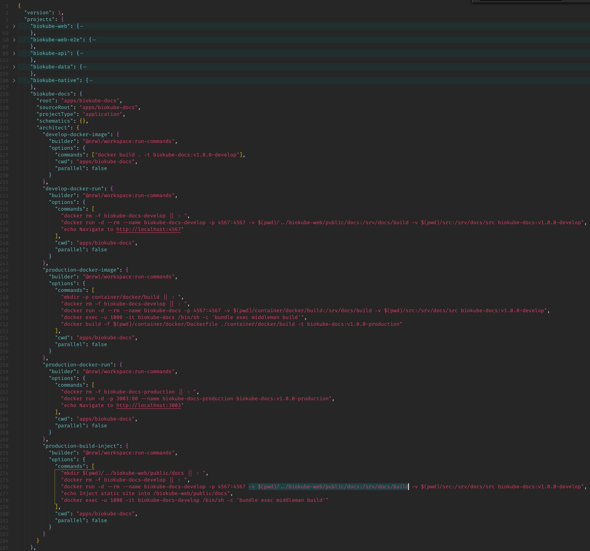](../images/nx-workspace-json.png 'Click to enlarge')

To execute Nx run commands from the Nx Console just click on the triangular
arrow next to command you want to run

[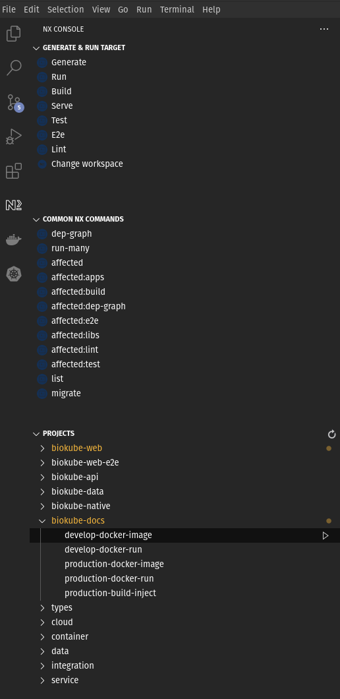](../images/vscode-nx-commands.png 'Click to enlarge')

To execute Nx run commands from the command line you can follow the following
pattern:

<code>`nx run <NX_APP | NX_LIB>:<ARCHITECT_KEY>`</code><br>

Examples:

<code>`nx run biokube-docs:develop-docker-image`</code>

<code>`nx run biokube-docs:develop-docker-run`</code>

<code>`nx run biokube-docs:production-docker-image`</code>

<code>`nx run biokube-docs:production-docker-run`</code>

<code>`nx run biokube-docs:production-build-inject`</code>

> 6\. Nx Run Commands Examples

```shell
nx run biokube-docs:develop-docker-image
nx run biokube-docs:develop-docker-run
nx run biokube-docs:production-docker-image
nx run biokube-docs:production-docker-run
nx run biokube-docs:production-build-inject
```

## Setup Kubernetes

Kubernetes is a portable, extensible, open-source platform for managing
containerized workloads and services, that facilitates both declarative
configuration and automation.

The name
[Kubernetes](https://kubernetes.io/docs/concepts/overview/what-is-kubernetes/)
originates from Greek, meaning helmsman or pilot. Google open-sourced the
Kubernetes project in 2014. Kubernetes combines over 15 years of Google's
experience running production workloads at scale with best-of-breed ideas and
practices from the community.

To easyly spin up and tear down kubernetes clusters locally <b>Biokube</b> will
use [K3D](https://k3d.io/).<br> Production workloads are deployed on lightweight
[K3S](https://k3s.io/) or on classic full blown [K8S](https://kubernetes.io/).
To interact from the command line with any kubernetes cluster - be it a local
cluster on K3D or a lightweight K3S cluster or a classic K8S on-prem or on any
of the cloud based managed kubernetes services like Google GKE, Amazon EKS or
Microsoft AKS - you will always need to have the <code>kubectl</code> go binary
installed on your system to interact with any of them.

### 1\. Install kubectl

<code>`curl -LO https://storage.googleapis.com/kubernetes-release/release/`\``curl -s https://storage.googleapis.com/kubernetes-release/release/stable.txt`\``/bin/linux/amd64/kubectl`</code>
Downloads linux version of latest stable release of `kubectl` binary

<code>`chmod +x ./kubectl`</code> Makes `kubectl` binary executable

<code>`sudo mv ./kubectl /usr/local/bin/kubectl`</code> Moves the `kubectl` go
binary to `/usr/local/bin/` so that it can be executed from any directory on the
system (since `/usr/local/bin/` always belongs to the `$PATH` variable)

<code>`kubectl version -o json`</code> Shows client (kubectl) and server
(kubernetes api) version information of the current cluster context

<code>`kubectl config view --minify --raw`</code> Shows the contents of
`$HOME/.kube/config`

<code>`cat $HOME/.kube/config`</code> Shows the contents of `$HOME/.kube/config`

> 1\. Install kubectl

```shell
curl -LO https://storage.googleapis.com/kubernetes-release/release/`curl -s https://storage.googleapis.com/kubernetes-release/release/stable.txt`/bin/linux/amd64/kubectl

chmod +x ./kubectl
sudo mv ./kubectl /usr/local/bin/kubectl
kubectl version -o json
kubectl config view --minify --raw
cat $HOME/.kube/config
```

### 2\. Setup kubectl autocompletion

<code>`sudo apt-get install bash-completion`</code> Installs `bash-completion`
package

Add the following lines to the beginning of <code>~/.zshrc</code>

&emsp;`autoload -Uz compinit` # Marks `compinit` function as autoloadable<br>
&emsp;`compinit` # compinit is the function that initializes the zsh completion
system

Then run the following commands:

<code>`echo 'source <(kubectl completion zsh)' >>~/.zshrc`</code> Appends this
line to `~/.zshrc`

<code>`echo 'alias k=kubectl' >>~/.zshrc`</code> Appends this line to `~/.zshrc`

<code>`echo 'complete -F \_\_start_kubectl k' >>~/.zshrc`</code> Appends this
line to `~/.zshrc`

<code>`source ~/.zshrc`</code> Reads and executes the content of `~/.zshrc`

> 2\. Setup kubectl autocompletion

```shell
sudo apt-get install bash-completion

# Add the following lines to the beginning of ~/.zshrc :
autoload -Uz compinit
compinit

# Then run the following commands :
echo 'source <(kubectl completion zsh)' >>~/.zshrc
echo 'alias k=kubectl' >>~/.zshrc
echo 'complete -F \_\_start_kubectl k' >>~/.zshrc
source ~/.zshrc
```

### 3\. Setup kubectx and kubens

<code>`sudo git clone https://github.com/ahmetb/kubectx /opt/kubectx`</code>
Downloads `kubectx` to `/opt/kubectx`

<code>`sudo chmod +x /opt/kubectx/kubectx`</code> Makes `kubectx` executable

<code>`sudo chmod +x /opt/kubectx/kubens`</code> Makes `kubens` executable

<code>`sudo ln -s /opt/kubectx/kubectx /usr/local/bin/kubectx`</code> Creates
symbolic link `/usr/local/bin/kubectx` so that `kubectx` can be executed from
any directory on your system<br> (since `/usr/local/bin/` always belongs to your
`$PATH` variable)

<code>`sudo ln -s /opt/kubectx/kubens /usr/local/bin/kubens`</code> Creates
symbolic link `/usr/local/bin/kubens` so that `kubens` can be executed from any
directory on your system.

<code>`mkdir -p ~/.oh-my-zsh/completions`</code> Creates folder where
`oh-my-zsh` will look for the auto-complete scripts for `kubectx` and `kubens`

<code>`chmod -R 755 ~/.oh-my-zsh/completions`</code> Set executable permissions
for all files in this folder

<code>`ln -s /opt/kubectx/completion/kubectx.zsh ~/.oh-my-zsh/completions/\_kubectx.zsh`</code>
Creates symbolic link `~/.oh-my-zsh/completions/\_kubectx.zsh`

<code>`ln -s /opt/kubectx/completion/kubens.zsh ~/.oh-my-zsh/completions/\_kubens.zsh`</code>
Creates symbolic link `~/.oh-my-zsh/completions/\_kubens.zsh`

<code>`git clone --depth 1 https://github.com/junegunn/fzf.git ~/.fzf && ~/.fzf/install`</code>
Download and install `fzf`. `fzf` enables `kubectx` and `kubens` commands to
present you an interactive menu with fuzzy searching.

<code>`source ~/.zshrc`</code> Reads and executes the content of `~/.zshrc`

> 3\. Setup kubectx and kubens

```shell
sudo git clone https://github.com/ahmetb/kubectx /opt/kubectx
sudo chmod +x /opt/kubectx/kubectx
sudo chmod +x /opt/kubectx/kubens
sudo ln -s /opt/kubectx/kubectx /usr/local/bin/kubectx
sudo ln -s /opt/kubectx/kubens /usr/local/bin/kubens

mkdir -p ~/.oh-my-zsh/completions
chmod -R 755 ~/.oh-my-zsh/completions
ln -s /opt/kubectx/completion/kubectx.zsh ~/.oh-my-zsh/completions/_kubectx.zsh
ln -s /opt/kubectx/completion/kubens.zsh ~/.oh-my-zsh/completions/_kubens.zsh

git clone --depth 1 https://github.com/junegunn/fzf.git ~/.fzf
~/.fzf/install
source ~/.zshrc
```

### 4\. Install K3D

<code>`curl -s https://raw.githubusercontent.com/rancher/k3d/main/install.sh | bash`</code><br>
Downloads and executes the K3D installation script

<code>`k3d version`</code><br> Shows installed K3D version

<code>`k3d cluster list`</code><br> Shows a list of all kubernetes clusters
inside K3D

<code>`k3d cluster create biokube --api-port 6550 --servers 1 --agents 3 --port 8888:80@loadbalancer --volume /home/pmualaba/Development/bio8/biokube:/src@all`</code><br>
Creates a new kubernetes cluster inside K3D named `biokube` with 1 server
(Master node) and 3 agents (Worker nodes). <br> The kubernetes API for this
cluster listens at `https://0.0.0.0:6550/`<br> The deployed workload services
will be reachable via the built in Traefik loadbalancer listening at
`http://0.0.0.0:8888/`

<code>`k3d kubeconfig merge biokube --merge-default-kubeconfig --switch-context`</code><br>
Add this k3d cluster to ~/.kube/config and switch to this cluster context (alias
-ds)

<code>`k3d kubeconfig merge --all --merge-default-kubeconfig`</code><br> Add all
created k3d clusters to ~/.kube/config (alias -ad)

<code>`kubectl cluster-info`</code><br>

<code>`kubectl get nodes`</code><br>

#### Install K3X (Optional Linux Compatible Only)

[K3X](https://github.com/inercia/k3x) is a graphical user interface for K3D,
making it trivial to create and destroy your own local Kubernetes cluster(s).

<code>`flatpak install flathub com.github.inercia.k3x`</code> Installs K3X on
your local system

<code>`flatpak run com.github.inercia.k3x`</code> Launches K3X

#### K3D Commands

K3D uses <code>`containerd`</code> as Container Runtime in stead of
<code>`docker`</code>. So to import Docker images from your local Docker host to
K3D containerd, you need to run <code>`k3d image import`</code>. In order to
make the Container Runtime images available for helm, this command imports the
specified Docker image to every node in the specified K3D cluster(s) and is
executed behind the scenes using a special purpose <code>`k3d-tools`</code>
container

<code>`k3d image import biokube-docs:v1.0.0-production --cluster biokube`</code>
Imports this image into the K3D cluster named biokube.

<code>`k3d cluster delete biokube`</code> Deletes the K3D cluster named biokube

> 4\. Install K3D

```shell
curl -s https://raw.githubusercontent.com/rancher/k3d/main/install.sh | bash

k3d version
k3d cluster list
k3d cluster create biokube --api-port 6550 --servers 1 --agents 3 --port 8080:80@loadbalancer --volume /home/pmualaba/Development/bio8/biokube:/src@all
k3d kubeconfig merge biokube --merge-default-kubeconfig --switch-context
k3d kubeconfig merge --all --merge-default-kubeconfig
kubectl cluster-info
kubectl get nodes

# Install K3X (Optional Linux Compatible Only)
flatpak install flathub com.github.inercia.k3x
flatpak run com.github.inercia.k3x

# K3D Commands
k3d image import biokube-docs:v1.0.0-production --cluster biokube
k3d cluster delete biokube
```

### 5\. Install Kubernetes IDE Lens

[Lens](https://k8slens.dev/) is an IDE for people who need to deal with
Kubernetes clusters on a daily basis. It is a standalone application for MacOS,
Windows and Linux operating systems. Ensure your clusters are properly setup and
configured. Enjoy increased visibility, real time statistics, log streams and
hands-on troubleshooting capabilities. With Lens, you can work with your
clusters more easily and fast, radically improving productivity and the speed of
business.

Download Lens form their [releases](https://github.com/lensapp/lens/releases/)
page.

For Linux users download the <code>AppImage</code> file.

<code>`mkdir ~/Applications`</code> Creates Application folder inside your home
directory. (optional)

<code>`cd ~/Applications`</code> Sets the directory where you want to download
the AppImage file to.

<code>`curl -LO https://github.com/lensapp/lens/releases/download/v3.5.2/Lens-3.5.2.AppImage`</code>
Downloads the AppImage file.

<code>`chmod +x Lens-3.5.2.AppImage`</code> Makes the AppImage file executable

<code>`./Lens-3.5.2.AppImage`</code> Launches Lens

[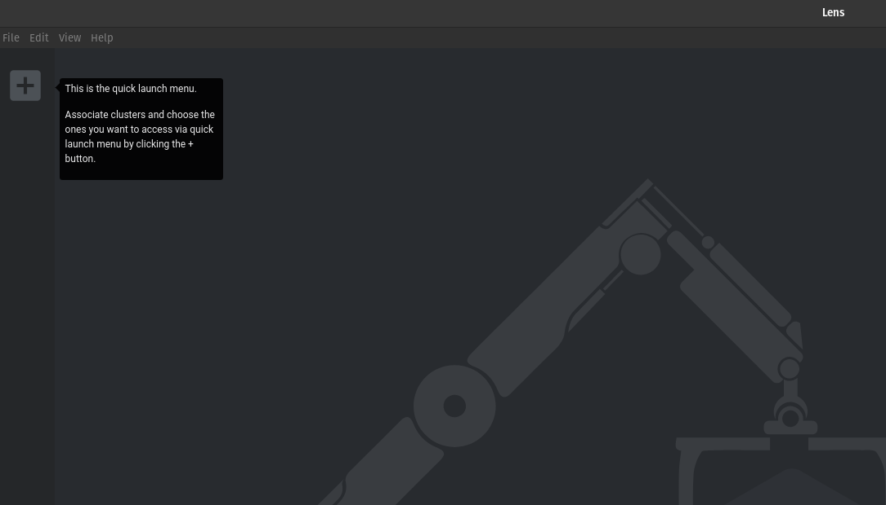](../images/kubernetes-lens.png 'Click to enlarge')

Click on the + button to add a cluster you want to manage in Lens. Then on the
next screen select a kubernetes cluster context from the dropdown list. <br> By
default Lens will list all the cluster contexts that are defined in the default
kubeconfig file which is located at `$HOME/.kube/config`. Select the cluster you
want to manage in Lens from the dropdown. You can repeat this step if you want
to manage multiple clusters.

[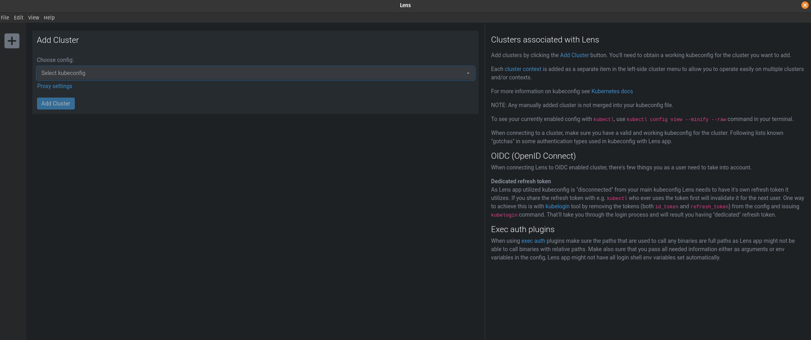](../images/kubernetes-lens-add-cluster.png 'Click to enlarge')

Now you can easily switch between multiple kubernetes clusters using the buttons
on the side.

[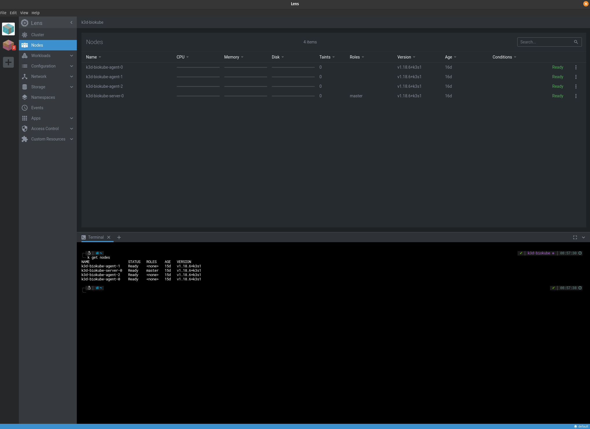](../images/kubernetes-lens-cluster-management.png 'Click to enlarge')

### 5\. Install Kubernetes K9S

[K9S](https://github.com/derailed/k9s) provides a terminal UI to interact with
your Kubernetes clusters. K9s continually watches Kubernetes for changes and
offers subsequent commands to interact with your observed resources.

Download and unzip the [latest](https://github.com/derailed/k9s/releases)
release of K9S. Then move the binary to a location in your `$PATH`.

<code>`cd /tmp && curl -LO https://github.com/derailed/k9s/releases/download/v0.21.7/k9s_Linux_x86_64.tar.gz`</code>

<code>`tar xzvf k9s_Linux_x86_64.tar.gz --one-top-level`</code>

<code>`sudo mv k9s_Linux_x86_64/k9s /usr/local/bin`</code>

<code>`rm -rf k9s_Linux_x86_64`</code>

### 6\. Install helm

[Helm](https://helm.sh/) is a package manager for kubernetes applications. The
purpose of using Helm is to easily deploy, upgrade, rollback or destroy
multi-container kubernetes applications. Helm manages Kubernetes resource
packages through Charts. A chart is nothing but a set of information necessary
to create a Kubernetes application. A running instance of a chart with a
specific config is called a release. <b>Biokube</b> uses Helm 3.

<code>`curl -fsSL -o get_helm.sh https://raw.githubusercontent.com/helm/helm/master/scripts/get-helm-3`</code>

<code>`chmod 700 get_helm.sh`</code>

<code>`./get_helm.sh`</code>

<code>`rm get_helm.sh`</code>

<code>`helm version`</code>

<code>`helm repo add stable https://kubernetes-charts.storage.googleapis.com/`</code>

<code>`helm repo update`</code>

<code>`helm search repo stable`</code>

#### Install Helm plugins

<code>`helm plugin install https://github.com/chartmuseum/helm-push`</code>

<code>`helm plugin install https://github.com/databus23/helm-diff`</code>

### Install helmfile

<code>`curl -fSL -o helmfile https://github.com/roboll/helmfile/releases/download/v0.125.6/helmfile_linux_amd64`</code>

<code>`chmod +x helmfile`</code>

<code>`sudo mv helmfile /usr/local/bin`</code>

> 6\. Install helm

```shell
curl -fsSL -o get_helm.sh https://raw.githubusercontent.com/helm/helm/master/scripts/get-helm-3
chmod 700 get_helm.sh
./get_helm.sh
rm get_helm.sh

helm version
helm repo add stable https://kubernetes-charts.storage.googleapis.com/
helm repo update
helm search repo stable

helm plugin install https://github.com/chartmuseum/helm-push
helm plugin install https://github.com/databus23/helm-diff

curl -fSL -o helmfile https://github.com/roboll/helmfile/releases/download/v0.125.6/helmfile_linux_amd64
chmod +x helmfile
sudo mv helmfile /usr/local/bin

```

### 7\. Helm Commands

<code>`helm upgrade --install biokube-docs apps/biokube-docs/container/helm/v1.0.0-production --namespace biokube --set app.image=biokube-docs:v1.0.0-production`</code>

> 7\. Install Helm Chart to K3D cluster

```shell
helm upgrade --install biokube-docs apps/biokube-docs/container/helm/v1.0.0-production --namespace biokube --set app.image=biokube-docs:v1.0.0-production
```

### 9\. Kubernetes Commands

The following sections contains a list of the most used <code>kubectl</code>
commands and techniques to interact with your kubernetes clusters on a
day-to-day basis.

#### 9.1\. Kubernetes Cluster

<code>`k config get-contexts`</code> show current cluster

<code>`k config use-context <CONTEXT_NAME>`</code> switch cluster

<code>`k cluster-info`</code> show current cluster info

> 9.1\. Kubernetes Cluster

```shell
k config get-contexts
k config use-context <CONTEXT_NAME>
k cluster-info
```

#### 9.2\. Kubernetes API

<code>`k api-resources`</code> show list of existing api-resources

<code>`k api-resources --api-group=apps`</code> show list of existing resources
within a specific api-group

<code>`k api-resources --namespaced=true`</code> show list of existing resources
that are namespacable

<code>`k api-versions | sort`</code> show available resource api-group versions

<code>`k explain Pod`</code> explain Pod resource fields

<code>`k explain Pod.spec`</code> explain Pod.spec resource fields

> 9.2\. Kubernetes API

```shell
k api-resources
k api-resources --api-group=apps
k api-resources --namespaced=true
k api-versions | sort

k explain pods
k explain pods.spec
```

#### 9.3\. Kubernetes Namespace

<code>`k get namespaces`</code> show all namespaces (alias ns)

<code>`k get all --all-namespaces -o wide`</code> show all resources across all
namespaces (alias -A)

<code>`k get pods --all-namespaces`</code> show all pods across all namespaces
(alias -A)

<code>`k describe namespace <NAMESPACE>`</code> show this namespace with details
(alias ns)

<code>`k get all --namespace=<NAMESPACE>`</code> show all resources inside this
namespace (alias -n)

<code>`k get pods --namespace=<NAMESPACE>`</code> show all pods inside this
namespace (alias po -n)

<code>`k get pods`</code> show all pods inside the default namespace (alias po)

> 9.3\. Kubernetes Namespace

```shell
k get namespaces
k get all --all-namespaces -o wide
k get pods --all-namespaces
k describe namespace <NAMESPACE>
k get all --namespace=<NAMESPACE>
k get pods --namespace=<NAMESPACE>
k get pods
```

#### 9.4\. Kubernetes Pod

<code>`k get pods`</code> show all pods inside the default namespace (alias po)

<code>`k get pods --namespace=<NAMESPACE>`</code> show all pods inside this
namespace (alias po -n)

<code>`k describe pod <POD_NAME>`</code> show this pod with details (alias po)

#### 9.5\. Kubernetes Deployment

#### 9.6\. Kubernetes StatefulSet

#### 9.7\. Kubernetes DaemonSet

#### 9.8\. Kubernetes Service

<code>`k get services --namespace=<NAMESPACE>`</code> show all services inside
this namespace (alias svc -n)

<code>`k describe service <SERVICE_NAME>`</code> show this service with details
(alias svc)

<code>`k describe endpoint <SERVICE_NAME>`</code> show endpoints associated with
this service (alias ep)

<code>`k get pods --show-labels`</code> show pods and the labels associated with
these pods (alias po -l)

<code>`k get pods --selector tier=prod`</code> select pods with label tier=prod,
alias -l

<code>`k get pods -l 'tier=prod,app!=MyWebApp'`</code> eq AND neq

<code>`k get pods -l 'tier in (prod, qa)'`</code>

<code>`k get pods -l 'tier notin (prod, qa)'`</code>

<code>`k get pods -L tier,app`</code> show TIER and APP label columns

<code>`k get node -L disk,hardware`</code> show TIER and HARDWARE label columns

<code>`k label pod --all tier=non-prod --overwrite`</code> update label value
for label key tier to 'non-prod' on all pods in the default namespace

<code>`k label node c1-node1 disk=local_ssd`</code> label a node

<code>`k delete pods --all --namespace default`</code> delete all pods inside
default namespace, <br> be aware that this command is rather useless since
kubernetes will try to bring them back because of the deployment definition
which contains a replicaset

<code>`k delete delete namespace <NAMESPACE>`</code> delete all resources inside
<NAMESPACE>

<code>`k delete pod -l tier=non-prod`</code> delete selection of pods

<code>`k exec -v 6 -it <POD_NAME> -- /bin/sh`</code>

<code>`k logs <POD_NAME>`</code>

<code>`k port-forward <POD_NAME>-<pod-template-hash/replicaset-id>-<pod-id> <LOCAL_PORT>:<CONTAINER_PORT>`</code>
make sure you use linux non-priviledge port (>1024) as <LOCAL_PORT>

<code>`curl http://localhost:<LOCAL_PORT>`</code>

<code>`k scale deployment <DEPLOYMENT_NAME> --replicas=2`</code>

<code>`k get endpoints <SERVICE_NAME>`</code>
<code>`PODIP=$(kubectl get endpoints <SERVICE_NAME> -o jsonpath='{.subsets[].addresses[].ip }')`</code>

> 9.4\. Kubernetes Pod

```shell
k get namespaces
k describe namespaces
k describe pod <POD_NAME>
k describe endpoint <SERVICE_NAME>

k get pods all --all-namespaces -o wide
k get pods all --namespace=default
k get pods --all-namespaces
k get pods --namespace kube-system
k get pods
k get pods --show-labels
k get pods --selector tier=prod
k get pods -l 'tier=prod,app!=MyWebApp'
k get pods -l 'tier in (prod, qa)'
k get pods -l 'tier notin (prod, qa)'
k get pods -L tier,app
k get node -L disk,hardware

k label pod --all tier=non-prod --overwrite
k label node c1-node1 disk=local_ssd

k delete pods --all --namespace default
k delete delete namespace <NAMESPACE>
k delete pod -l tier=non-prod
k delete -f ./<INGRESS_CONTROLLER.yaml>

k exec -v 6 -it <POD_NAME> -- /bin/sh
k logs <POD_NAME>
k port-forward <POD_NAME>-<pod-template-hash/replicaset-id>-<pod-id> <LOCAL_PORT>:<CONTAINER_PORT>
curl http://localhost:<LOCAL_PORT>

k scale deployment <DEPLOYMENT_NAME> --replicas=2

k get endpoints <SERVICE_NAME>

```

#### 9.4\. Kubernetes Cluster DNS Service

The generated domain names for <code>services</code> in a kubernetes cluster are
formatted as follows:

<code>`<SERVICE_NAME>.<NAMESPACE>.svc.cluster.local`</code>

<code>`nslookup <SERVICE_NAME>.<NAMESPACE>.svc.cluster.local <kube-dns_CLUSTER-IP>`</code>

#### Kubernetes Debugging

k proxy & (start a local Proxy server at http://localhost:8001 for debugging)
curl http://localhost:8001/api/v1/namespaces/kube-system/pods (Interact with
kubernetes REST Api for debugging, this outputs raw JSON in stead of formatted
tables)

k get pods --watch & (Watch for state changes on a specific request) netstat
-plant | grep kubectl (check for an ESTABLISHED TCP connection) fg (bring back
background processvto foreground, now you can CTRL + C this process)

k get pod <POD_NAME> -v 6 (kubectl command with increased verbosity level to
disclose all REST API requests executed for this command)

k label pod <POD_NAME>-<pod-template-hash/replicaset-id>-<pod-id>
'pod-template-hash=DEBUG,app=DEBUG' --overwrite (put Pod outside of the
selectorscope of the ReplicaSet AND out of the selectorscope of the Service so
that the ReplicaSet does not recreate it and so that the Service removes it from
its Endpoints list) k get pods --show-labels

k get events --watch &

k get nodes --watch (watch node status)

k exec -v 6 -it <POD_NAME> -- /bin/sh ps exit k exec -it <POD_NAME> --
/usr/bin/killall <PROCESS_NAME> (Use the process COMMAND you got from running ps
inside the container)

Show Environment Variables inside Container

k exec -it <POD_NAME> -- /bin/sh -c "printenv | sort" k exec -it <POD_NAME> --
env | sort"

Hit Ingress

curl http://<INGRESS_IP>/<PATH> --header 'Host: <HOST.example.com>' curl
https://<INGRESS_HOST>:443 --resolve <INGRESS_HOST>:443:<INGRESS_IP> --insecure
--verbose (use --insecure for selfsigned certs)

k run -it --rm curl --restart=Never --image=nbrown/curl -- <SERVICE_NAME or
SERVICE_IP>:<SERVICE_PORT>

#### Kubernetes Scripting

GetServiceIpByServiceName:

SERVICEIP=$(kubectl get service | grep <SERVICE_NAME> | awk '{ print $3 }')
`SERVICEIP=$(kubectl get service <SERVICE_NAME> -o jsonpath='{ .spec.clusterIP }')`

GetFirstPodNameFromDeployment

PODNAME=$(kubectl get pods | grep <DEPLOYMENT_NAME> | awk '{ print $1 }' | head
-n 1)

GetSecretValue

`echo $(kubectl get secret <SECRET_NAME> --template={{.data.<KEY_NAME>}} | base64 --decode)`

GetIngressIP

`INGRESSIP=$(kubectl get ingress -o jsonpath='{ .items[].status.loadBalancer.ingress[].ip }')`

k create secret tls tls-secret --key tls.key --cert tls.crt

GetPodIP

`PODIP=$(kubectl get endpoints <SERVICE_NAME> -o jsonpath='{.subsets[].addresses[].ip }')`

#### Kubernetes secret for docker-registry

sudo chown $(id -u):$(id -g) ~/.docker/ sudo chown $(id -u):$(id -g)
~/.docker/config.json

k create secret docker-registry docker-hub-login
--docker-server=https://index.docker.io/v1/ --docker-username=<USERNAME>
--docker-password=<PASSWORD> --docker-email=<EMAIL>

## Setup Biokube Docs

Since every application development project needs some form of public facing
documentation, Biokube includes a dedicated Nx app project which does just that.
<code>`biokube-docs`</code> is based on the popular
[https://github.com/slatedocs/slate](https://github.com/slatedocs/slate).
Several Nx custom run commands are pre-configured already for you. You con run
them from terminal inside the root of the monorepo or launch them from NX
Console inside VS Code.

### 1\. Create development docker container

To create a local development container for authoring and editing your public
facing documentation using Markdown, just run
<code>`nx run biokube-docs:develop-docker-image`</code> and when the development
image has finished building, run a development container with the following
command: <code>`nx run biokube-docs:develop-docker-run`</code>.

Behind the scenes <code>`nx run biokube-docs:develop-docker-run`</code> executes
a <code>`docker run`</code> command with a hostmount volume param
<code>`-v $(pwd)/../biokube-web/public/docs:/srv/docs/build`</code> that links
to an existing empty build folder on the Docker host. This empty build directory
will later be used as output directory for static site generation from within
the container. (see step 3.)

The documentation project will be served for development at
[http://localhost:4567](http://localhost:4567)

Now you can make changes to your documentation content and styles.

Documentation pages are stored as Markdown files located at:

&emsp;&emsp;<b>src/index.html.md</b> <br>
&emsp;&emsp;<b>src/includes/\_\<YOUR_DOCUMENTATION_PAGES>.md</b>

Images for your Documentation pages are stored in:

&emsp;&emsp;<b>src/images</b>

You can edit styling in the following SASS stylesheets:

&emsp;&emsp;<b>src/stylesheets/\_variables.scss</b> <br>
&emsp;&emsp;<b>src/stylesheets/screen.css.scss</b>

Navigate to [http://localhost:4567/](http://localhost:4567/) and Refresh your
browser to see the changes.

> 1\. Create docker container image

```shell
nx run biokube-docs:develop-docker-image
docker image list

nx run biokube-docs:develop-docker-run
docker container list
```

### 2\. Create production docker container

To create a stand-alone production container for serving the public facing
documentation, first run
<code>`nx run biokube-docs:production-docker-image`</code>. Behind the scenes
this command first runs the developer Docker container (see step 1) but with a
different hostmount volume param
<code>`-v $(pwd)/container/docker/build:/srv/docs/build`</code>. This build
directory is used as output directory for the static site generation from within
the development container.

Next, a <code>`docker build`</code> command is executed, to persist the static
site that was generated (<code>`COPY`</code> from
biokube-docs/container/docker/build) into the production Docker image.

Now you can run a production container from this production image locally with
the following command <code>`nx run biokube-docs:production-docker-run`</code>

The production documentation container will be served at
[http://localhost:3003](http://localhost:3003)

This image can also be used to be deployed in your production kubernetes
cluster.

> 2\. Run docker container

```shell
nx run biokube-docs:production-docker-image
docker image list

nx run biokube-docs:production-docker-run
docker container list
```

### 3\. Create production build

If you don't want to run a separate stand-alone container to serve the public
facing documentation, you can opt to inject the generated static site into the
<code>`biokube-web`</code> container inside <code>`/public/docs`</code> folder.
This is done by running
<code>`nx run biokube-docs:production-build-inject`</code>

Behind the scenes <code>`nx run biokube-docs:production-build-inject`</code>
executes a <code>`docker run`</code> command from the developer container image
with a hostmount volume param
<code>`-v $(pwd)/../biokube-web/public/docs:/srv/docs/build`</code> that links
to <code>`biokube-web/public/docs`</code>. This build directory is used as
output directory for static site generation from within the development
container.<br> This results in injecting the static site into
<code>`/public/docs`</code> folder inside the <code>`biokube-web`</code> Nx app
project.

The generated static assets can also be hosted on your favorite cloud provider.

> 3\. Inject production build

```shell
nx run biokube-docs:production-build-inject
docker container list
```

### 4\. Nx Custom Run Commands

Nx allows the creation of Custom Run Commands. We created some convenient Nx
Custom Run Commands for <code>`biokube-docs`</code>

<code>`develop-docker-image`</code> <br> &emsp;Creates a docker image named
<code>`biokube-docs:v1.0.0-develop`</code> for local development<br>

<code>`develop-docker-run`</code> <br> &emsp;Runs a docker container from image
<code>`biokube-docs:v1.0.0-develop`</code> and serves it at
[http://localhost:4567](http://localhost:4567)<br>

<code>`production-docker-image`</code> <br> &emsp;Creates a docker image named
<code>`biokube-docs:v1.0.0-production`</code> for production with static content
persisted inside the docker image.<br>

<code>`production-docker-run`</code> <br> &emsp;Runs a docker container from
image <code>`biokube-docs:v1.0.0-production`</code> for production with static
content persisted inside the docker image and serves it at
[http://localhost:3003](http://localhost:3003).<br>

<code>`production-build-inject`</code> <br> &emsp;From a running
<code>`biokube-docs:v1.0.0-develop`</code> development container builds a static
site from src and injects the generated static site in
<code>`biokube-web`</code> app inside <code>`/public/docs`</code> folder.<br>

> 4\. Nx Custom Run Commands

```shell
nx run biokube-docs:develop-docker-image
nx run biokube-docs:develop-docker-run
nx run biokube-docs:production-docker-image
nx run biokube-docs:production-docker-run
nx run biokube-docs:production-build-inject
```

## Setup Biokube API

<code>`biokube-api`</code> is setup as a Nx app inside the Biokube Nx monorepo
workspace. It runs as a docker container and consolidates all backend API
libraries into a unified stateless scalable API

## Setup Biokube Data

<code>`biokube-data`</code> is setup as a Nx app inside the Biokube Nx monorepo
workspace. It runs as a collection of dedicated stateful docker containers to
form a datalake with a unified Data API that stores and provides different types
of data to and from the Biokube API. This way Data products and Functional logic
can be decoupled easily.

## Setup Biokube Web

<code>`biokube-web`</code> is setup as a Nx app inside the Biokube Nx monorepo
workspace. It runs as a docker container and serves as UI server for the web
browser. <br> An additional <code>`biokube-web-e2e`</code> project is created by
Nx alongside <code>`biokube-web`</code> to easily write and execute end-to-end
test scenarios for the <code>`biokube-web`</code> container.

## Setup Biokube Native

<code>`biokube-native`</code> is setup as a Nx app inside the Biokube Nx
monorepo workspace. It contains the directory structure recommended for React
Native mobile development. If you want to develop Apple iOS apps you will need
to run Biokube on a Mac. If you run Biokube on Linux you will only be able to
build Android Apps

### 1\. Enable CPU Virtualization on Linux

Make sure VT or SVM CPU Virtualization is Enabled in BIOS check KVM support with
<code>`egrep -c '(vmx|svm)' /proc/cpuinfo`</code> (An outcome greater than 0
implies that virtualization is supported)

> 1\. Enable CPU Virtualization on Linux

```shell
egrep -c '(vmx|svm)' /proc/cpuinfo

sudo apt install cpu-checker
sudo kvm-ok

sudo apt install -y qemu qemu-kvm libvirt-daemon libvirt-clients bridge-utils virt-manager
sudo systemctl status libvirtd
```

### 2\. Install JAVA 8 JDK

> 2\. Install JAVA 8 JDK

```shell
sudo apt update
sudo apt install openjdk-8-jdk openjdk-8-jre
export JAVA_HOME=/usr/lib/jvm/java-8-openjdk-amd64
```

### 3\. Install Android Studio

[install Android Studio](https://reactnative.dev/docs/environment-setup)

Unpack the contents of the zip archive to
<code>`~/Applications/android-studio`</code>

To install Open a console and cd into
<code>`~/Applications/android-studio/bin`</code> and type:

<code>./studio.sh</code>

Choose a <code>Custom</code> setup when prompted to select an installation type.
Make sure the boxes next to all of the following are checked:

- <code>Android SDK</code>
- <code>Android SDK Platform</code>
- <code>Android Virtual Device</code>

Then, click <code>Next</code> to install all of these components.

### 4\. Install Android SDK

Android Studio installs the latest Android SDK by default. Building a React
Native app with native code, however, requires the
<code>`Android 10 (Q) SDK`</code> in particular.

The SDK Manager can be found within the Android Studio
<code>`Preferences`</code> dialog, under <code>Appearance & Behavior → System
Settings → Android SDK</code>

Select the <code>`SDK Platforms`</code> tab from within the SDK Manager, then
check the box next to <code>`Show Package Details`</code> in the bottom right
corner. Look for and expand the <code>Android 10 (Q)</code> entry, then make
sure the following items are checked:

- <code>Android SDK Platform 29</code>
- <code>Intel x86 Atom_64 System Image</code>
- <code>Google APIs Intel x86 Atom System Image</code>

Next, select the <code>`SDK Tools`</code> tab and check the box next to
<code>`Show Package Details`</code> here as well. Look for and expand the
<code>`Android SDK Build-Tools`</code> entry, then make sure that
<code>`29.0.2`</code> is selected.

Finally, click <code>Apply</code> to download and install the Android SDK and
related build tools.

### 5\. Configure the ANDROID_HOME environment variable

> 5\. Configure the ANDROID_HOME environment variable

```shell
nano ~/.zhsrc

`export ANDROID_HOME=$HOME/Android/Sdk`
`export PATH=$PATH:$ANDROID_HOME/emulator`
`export PATH=$PATH:$ANDROID_HOME/tools`
`export PATH=$PATH:$ANDROID_HOME/tools/bin`
`export PATH=$PATH:$ANDROID_HOME/platform-tools`

`source $HOME/.zhsrc`
```

Verify that <code>`ANDROID_HOME`</code> has been added to your path by running

```shell
`echo $PATH`
```

Please make sure you use the correct Android SDK path. You can find the actual
location of the SDK in the Android Studio <code>`Preferences`</code> dialog,
under <code>`Appearance & Behavior → System Settings → Android SDK`</code>

### 6\. Install Watchman

Download [Watchman](https://github.com/facebook/watchman/releases/latest)

Unzip and navigate into the unzipped folder

Then run the following commands:

<code>sudo mkdir -p /usr/local/{bin,lib} /usr/local/var/run/watchman</code>
<code>sudo cp bin/_ /usr/local/bin</code><br> <code>sudo cp lib/_
/usr/local/lib</code><br> <code>sudo chmod 755
/usr/local/bin/watchman</code><br> <code>sudo chmod 2777
/usr/local/var/run/watchman</code><br>

> 6\. Install Watchman

```shell
sudo mkdir -p /usr/local/{bin,lib} /usr/local/var/run/watchman
sudo cp bin/_ /usr/local/bin
sudo cp lib/_ /usr/local/lib
sudo chmod 755 /usr/local/bin/watchman
sudo chmod 2777 /usr/local/var/run/watchman
```

### 7\. Run Android Studio:

<code>`cd ~/Applications/android-studio/bin && ./studio.sh`</code>

> 7\. Run Android Studio:

```shell
cd ~/Applications/android-studio/bin && ./studio.sh
```

### 8\. Setup NX app project for React-Native:

> 8\. Setup NX app project for React-Native:

```shell
sudo npm i -g @react-native-community/cli@next

yarn add --dev @jbuijgers/nx-react-native
nx g @jbuijgers/nx-react-native:app biokube-native io.biokube.app
chmod a+x apps/biokube-native/android/gradlew

nx serve biokube-native
nx build biokube-native
```

### 9\. Run on Android Simulator

Open <code>`AVD Manager`</code> from Android Studio (<code>AVD Manager</code>
icon)<br> Open and Run (<code>Run</code> icon) Android Project
(<code>`apps/biokube-app/android`</code> folder) from Android Studio

### 10\. How to delete Nx React Native project

<code>`nx g @jbuijgers/nx-react-native:remove biokube-native`</code>

> 10\. How to delete Nx React Native project

```shell
nx g @jbuijgers/nx-react-native:remove biokube-native
```
