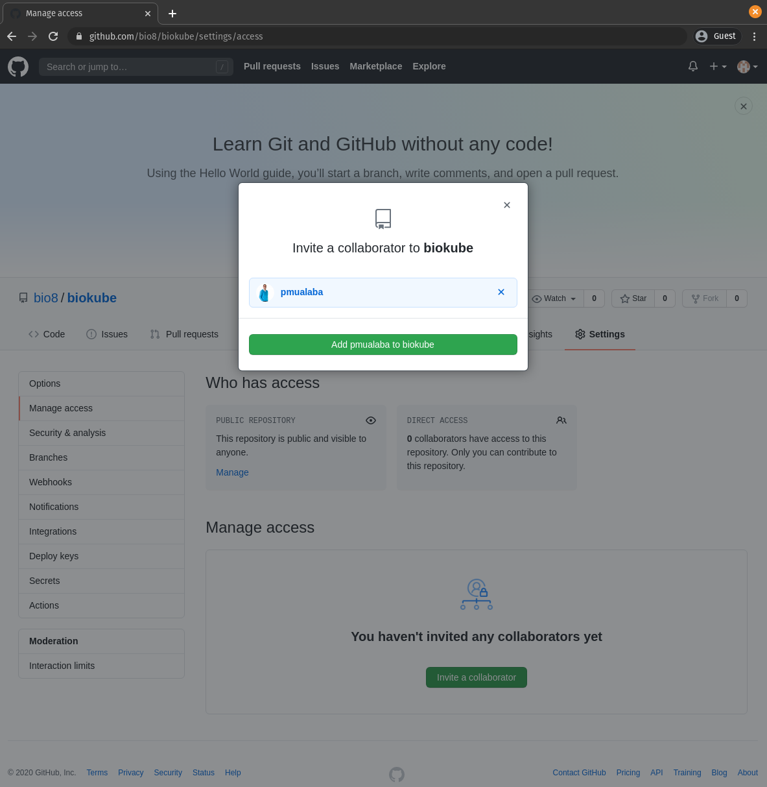
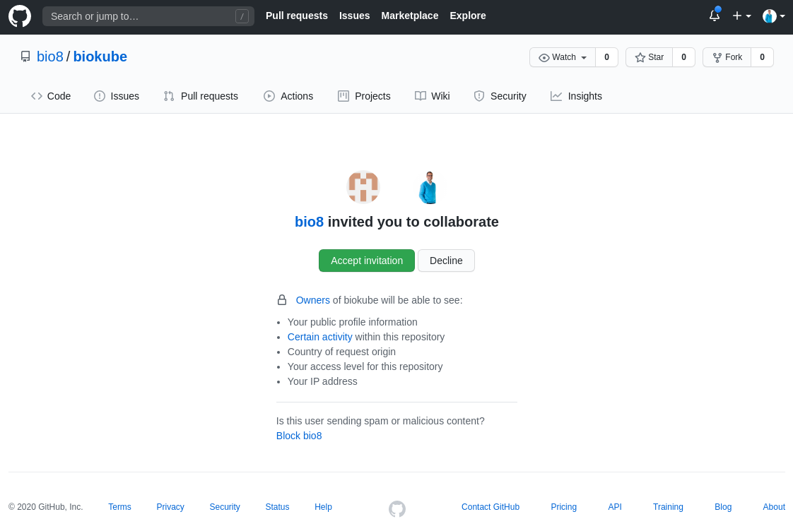
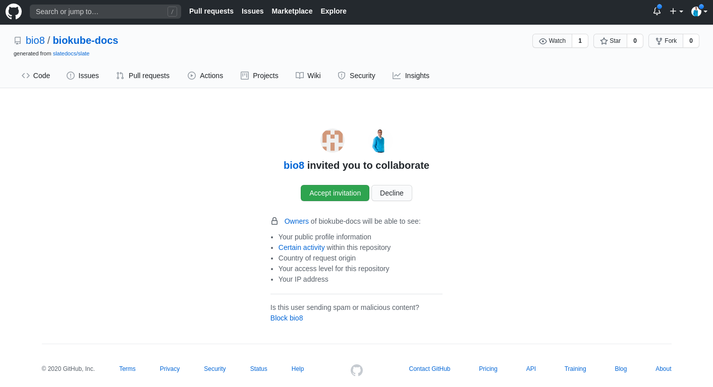

# Biokube Developer Docs

## Setup Docker

sudo apt update

sudo apt install apt-transport-https ca-certificates curl software-properties-common

curl -fsSL https://download.docker.com/linux/ubuntu/gpg | sudo apt-key add -

sudo add-apt-repository "deb [arch=amd64] https://download.docker.com/linux/ubuntu focal stable"

sudo apt update

apt-cache policy docker-ce

sudo apt install docker-ce

sudo systemctl status docker

sudo usermod -aG docker \${USER}

su - \${USER}

id -nG

docker ps

Install Portainer:
https://www.portainer.io/

docker volume create portainer_data
docker run -d -p 8000:8000 -p 9000:9000 --name=portainer --restart=always -v /var/run/docker.sock:/var/run/docker.sock -v portainer_data:/data portainer/portainer

http://localhost:9000

## Setup Nodejs

Step 1 – Install NVM

curl https://raw.githubusercontent.com/creationix/nvm/master/install.sh | bash

append the following lines to ~/.zshrc

nano ~/.zshrc
export NVM_DIR="$HOME/.nvm"
[ -s "$NVM_DIR/nvm.sh" ] && \. "\$NVM_DIR/nvm.sh" # This loads nvm

Step 2 – Find Available Node.js Version

nvm ls-remote

Step 3 – Installing selected Node.js versions with NVM

nvm install v12.18.2
nvm install v14.5.0

Step 4 – Set Node.js Default Version

nvm list
nvm use v12.18.2
node --version

Step 5 – Run Application with Specific Version

nvm run v12.18.2 app.js

Step 6 – Remove Unused Node.js Version

nvm list
nvm uninstall v4.9.1

## Setup Yarn

Run this command to install or update Yarn

curl --compressed -o- -L https://yarnpkg.com/install.sh | bash

## Setup Git

1. Add SSH Key

Create or locate your Public/Private RSA Keypair:
Your personal Private key is stored in file ~/.ssh/id_rsa<br>
Your personal Public key is stored in file ~/.ssh/id_rsa.pub

Restrict filesystem permissions on your <b>Private</b> key<br>
chmod 400 ~/.ssh/id_rsa

Copy your public key to GitHub

In your GitHub account profile menu click on <b>Settings</b> and then in the left menu on <b>SSH and GPG keys</b>

[](../images/github-add-ssh-key.png 'Click to enlarge')

2. Create Remote GIT repository on Github

Login to GitHub

[](../images/github-create-new-repository.png 'Click to enlarge')

Click on the <code>New</code> button

[](../images/github-create-new-public-repository.png 'Click to enlarge')

Click on <code>Create repository</code> button

3. Link local existing GIT repository to remote existing GitHub repository

### 3.1\. GitHub invite Collaborator

In order to be able to commit to a remote GitHub repository, you need to be the creator/owner or a valid collaborator for this repository.
If you manage multiple Github accounts you can still commit and collaborate with one and the same GitHub user account to multiple repositories over multiple GitHub accounts, by inviting the GitHub user account as a collaborator for that repository.<br>
Just login to the GitHub account that hosts the repository you like to collaborate to and invite your own Github user account to collaborate to that repository.
Click on <b>Settings</b> tab.
Click on <b>Manage access</b> menu item.
Click on <code>Invite a collaborator</code> button

[](../images/github-manage-access.png 'Click to enlarge')

An Email will be sent to the mailbox associated with your own GitHub account. Clicking on the <b>accept</b> link in the email will open a consent screen in GitHub where you can accept the invite.

[](../images/github-invite-collaborator-email.png 'Click to enlarge')

[](../images/github-invite-collaborator-accept.png 'Click to enlarge')

### 3.2\. Change <code>origin</code> of your GIT repository

In case you want to commit to another remote repository than the one you originally cloned from, you need to change the origin of your local GIT repository.
You can do this with this set of <code>git</code> commands. If <code>origin</code> is not set on the local repo you may skip the first command <code>git remote rm origin</code>.

> 3.2\. Change <code>origin</code> of your GIT repository

```shell
git remote rm origin
git remote add origin git@github.com:bio8/biokube.git
git config master.remote origin
git config master.merge refs/heads/master
git fetch
git branch --set-upstream-to=origin/master master
git pull origin master --allow-unrelated-histories
git push -u origin master
```

## Setup Visual Studio Code

### 1\. Install Visual Studio Code

Download and install Visual Studio Code or Visual Studio Code Insiders (Canary)

[Download Visual Studio Code](https://code.visualstudio.com/insiders/)<br>
[Download Visual Studio Code Insiders](https://code.visualstudio.com/insiders/)

### 2\. Install Visual Studio Code Fonts

#### Install Terminal Nerd Font:

Download and install (by double clicking) Nerd Font:

[MesloLGS NF Regular.ttf](https://github.com/romkatv/powerlevel10k-media/raw/master/MesloLGS%20NF%20Regular.ttf)<br>
[MesloLGS NF Bold.ttf](https://github.com/romkatv/powerlevel10k-media/raw/master/MesloLGS%20NF%20Bold.ttf)<br>
[MesloLGS NF Italic.ttf](https://github.com/romkatv/powerlevel10k-media/raw/master/MesloLGS%20NF%20Italic.ttf)<br>
[MesloLGS NF Bold Italic.ttf](https://github.com/romkatv/powerlevel10k-media/raw/master/MesloLGS%20NF%20Bold%20Italic.ttf)

#### Install Fira Code Font:

sudo apt update && sudo apt install fonts-firacode

#### Configure Fonts

Open File → Preferences → Settings and click on the icon  to toggle settings.json in code view.

[](../images/vscode-settings-json.png 'Click to enlarge')

Set "terminal.integrated.fontFamily": "MesloLGS NF"<br>
Set "editor.fontFamily": "'Fira Code', 'Operator Mono', 'Droid Sans Mono', 'monospace', monospace, 'Droid Sans Fallback'"

### 3\. Install Visual Studio Code Extensions

Install Your favorite Extensions:

[](../images/vscode-extensions.png 'Click to enlarge')

### 4\. Install Oh My zsh

Install Oh My Zsh
sudo apt install zsh
sh -c "\$(curl -fsSL https://raw.github.com/ohmyzsh/ohmyzsh/master/tools/install.sh)"

Install Oh My Zsh powerlevel10k theme

git clone --depth=1 https://github.com/romkatv/powerlevel10k.git ${ZSH_CUSTOM:-$HOME/.oh-my-zsh/custom}/themes/powerlevel10k

Install zsh autosuggestions:

git clone https://github.com/zsh-users/zsh-autosuggestions \${ZSH_CUSTOM:-~/.oh-my-zsh/custom}/plugins/zsh-autosuggestions

Update ~/.zshrc :

nano ~/.zshrc
ZSH_THEME="powerlevel10k/powerlevel10k"
plugins=(git zsh-autosuggestions)

reboot to load the Fonts we installed.

Now when you open a new terminal session the Oh My Zsh configuration wizard will be launched

You can always re-run the configuration wizard later with the following command:

p10k configure

How to Update powerlevel10k to the latest version:

git -C ${ZSH_CUSTOM:-$HOME/.oh-my-zsh/custom}/themes/powerlevel10k pull

How to Uninstall powerlevel10k:

rm -rf -- ${ZSH_CUSTOM:-$HOME/.oh-my-zsh/custom}/themes/powerlevel10k

### 5\. Visual Studio Code shortcuts

Delete line: CTRL + SHIFT + K<br>
Move line up/down: ALT + UP/DOWN
Multicursor: search a substring and then click on 1 instance and press CTRL + SHIFT + L
open Command Panel: CTRL + SHIFT + P

## Setup Document container

### 1\. Login to your [GitHub](https://github.com/) account where you want to host the repository for your documentation.

### 2\. Open [https://github.com/slatedocs/slate](https://github.com/slatedocs/slate) repository in that GitHub account.

### 3\. Fork the repository to that GitHub account.

Click on <b>Use this template</b> button.
Click on <b>Create repository from template</b> button.

[](../images/biokube-docs-github-create-new-repo-from-slate.png 'Click to enlarge')

### 4\. GitHub invite Collaborator

In order to be able to commit to a remote GitHub repository, you need to be the creator/owner or a valid collaborator for this repository.
If you manage multiple Github accounts you can still commit and collaborate with one and the same GitHub user account to multiple repositories over multiple GitHub accounts, by inviting the GitHub user account as a collaborator for that repository.<br>
Just login to the GitHub account that hosts the repository you like to collaborate to and invite your own Github user account to collaborate to that repository.
Click on <b>Settings</b> tab.
Click on <b>Manage access</b> menu item.

[](../images/github-invite-collaborator.png 'Click to enlarge')

An Email will be sent to the mailbox associated with your own GitHub account. Clicking on the <b>accept</b> link in the email will open a consent screen in GitHub where you can accept the invite.

[](../images/github-invite-collaborator-consent.png 'Click to enlarge')

### 5\. Clone the newly created repo to your local IDE

> 5\. Clone the newly created repo to your local IDE

```shell
git clone git@github.com:YOUR-GITHUB-ACCOUNT/biokube-docs.git
```

### 6\. Change <code>origin</code> of your GIT repository (optional)

In case you want to commit to another remote repository than the one you originally cloned from, you need to change the origin of your local GIT repository.
You can do this with this set of <code>git</code> commands. (replace <b>bio8</b> with your own GitHub account)

> 6\. Change <code>origin</code> of your GIT repository (optional)

```shell
git remote rm origin
git remote add origin git@github.com:bio8/biokube-docs.git
git config master.remote origin
git config master.merge refs/heads/master
git branch --set-upstream-to=origin/main main
git pull origin main --allow-unrelated-histories
```

### 7\. Create docker container image

Make sure to run <code>docker build</code> command in the root directory of the project in your IDE where your <code>Dockerfile</code> is located.

> 7\. Create docker container image

```shell
docker build . -t biokube-docs:latest
docker images
```

### 8\. Run docker container

Once the <code>biokube-docs</code> Docker image is created, you can launch a container from it using <code>docker run</code>. <br>
An empty build folder will also be created in the root of your project directory in your IDE. The build directory will be used for static site generation. (see step 9.)

> 8\. Run docker container

```shell
docker run -d --rm --name biokube-docs -p 4567:4567 -v $(pwd)/build:/srv/slate/build -v $(pwd)/source:/srv/slate/source biokube-docs
docker ps
```

Now you can make changes to your documentation content and styles.

Documentation pages are stored as Markdown files located at:

&emsp;&emsp;<b>source/index.html.md</b> <br>
&emsp;&emsp;<b>source/includes/\_YOUR-DOCUMENTATION-PAGES.md</b>

Images for your Documentation pages are stored in:

&emsp;&emsp;<b>source/images</b>

You can edit styling in the following SASS stylesheets:

&emsp;&emsp;<b>source/stylesheets/\_variables.scss</b> <br>
&emsp;&emsp;<b>source/stylesheets/screen.css.scss</b>

Navigate to [http://localhost:4567/](http://localhost:4567/) and Refresh your browser to see the changes.

### 9\. Production Build

You can run a <code>bundle exec</code> command (from within the Docker container), that will generate a production deployable static site version of your documentation. <br>
This command will output the static assets to this <code>build</code> folder. The static assets can be hosted on your favorite cloud provider.

> 9\. Production Build

```shell
docker exec -it biokube-docs /bin/bash -c "bundle exec middleman build"
```

## Setup Nx Workspace

sudo npm i -g @nrwl/cli

npx create-nx-workspace@latest biokube --preset=empty --cli=nx --skipGit=false --npm-scope=scope --nx-cloud=false

yarn add -D @nrwl/nest @nrwl/next

nx g @nrwl/next:app biokube-web --style="styled-components"

nx g @nrwl/nest:app biokube-api

nx g @nrwl/node:lib types
nx g @nrwl/node:lib cloud
nx g @nrwl/node:lib container
nx g @nrwl/node:lib data
nx g @nrwl/node:lib integration
nx g @nrwl/node:lib service

nx g @nrwl/next:lib blocks -d ui/web --pascalCaseFiles
nx g @nrwl/next:lib blocks -d ui/native --pascalCaseFiles

nx g @nrwl/next:lib elements -d ui/web --pascalCaseFiles
nx g @nrwl/next:lib elements -d ui/native --pascalCaseFiles
nx g @nrwl/next:component Button -p ui-web-elements -e
nx g @nrwl/next:component Button -p ui-native-elements -e

How to Delete a library:

nx g @nrwl/node:remove service --forceRemove

How to Display Dependency Graph

nx dep-graph

## Setup API container

Biokube is setup as a Nest.js Monorepo

## Setup React Native

Android Studio Setup

Make sure VT or SVM CPU Virtualization is Enabled in BIOS
check KVM support (An outcome greater than 0 implies that virtualization is supported)

egrep -c '(vmx|svm)' /proc/cpuinfo

sudo apt install cpu-checker
sudo kvm-ok

sudo apt install -y qemu qemu-kvm libvirt-daemon libvirt-clients bridge-utils virt-manager
sudo systemctl status libvirtd

Install JAVA 8 JDK

sudo apt update
sudo apt install openjdk-8-jdk openjdk-8-jre
export JAVA_HOME=/usr/lib/jvm/java-8-openjdk-amd64

1. Install Android Studio

[install Android Studio](https://reactnative.dev/docs/environment-setup)

Unpack the contents of the zip archive to ~/Applications/android-studio

To install Open a console and cd into "~/Applications/android-studio/bin" and type:
./studio.sh

Choose a "Custom" setup when prompted to select an installation type. Make sure the boxes next to all of the following are checked:

Android SDK
Android SDK Platform
Android Virtual Device
Then, click "Next" to install all of these components.

2. Install the Android SDK
   Android Studio installs the latest Android SDK by default. Building a React Native app with native code, however, requires the Android 10 (Q) SDK in particular.

The SDK Manager can be found within the Android Studio "Preferences" dialog, under Appearance & Behavior → System Settings → Android SDK.

Select the "SDK Platforms" tab from within the SDK Manager, then check the box next to "Show Package Details" in the bottom right corner. Look for and expand the Android 10 (Q) entry, then make sure the following items are checked:

Android SDK Platform 29
Intel x86 Atom_64 System Image AND Google APIs Intel x86 Atom System Image
Next, select the "SDK Tools" tab and check the box next to "Show Package Details" here as well. Look for and expand the "Android SDK Build-Tools" entry, then make sure that 29.0.2 is selected.

Finally, click "Apply" to download and install the Android SDK and related build tools.

3. Configure the ANDROID_HOME environment variable

nano ~/.zhsrc

export ANDROID_HOME=$HOME/Android/Sdk
export PATH=$PATH:$ANDROID_HOME/emulator
export PATH=$PATH:$ANDROID_HOME/tools
export PATH=$PATH:$ANDROID_HOME/tools/bin
export PATH=$PATH:\$ANDROID_HOME/platform-tools

source \$HOME/.zhsrc

Verify that ANDROID_HOME has been added to your path by running

echo \$PATH.

Please make sure you use the correct Android SDK path. You can find the actual location of the SDK in the Android Studio "Preferences" dialog, under Appearance & Behavior → System Settings → Android SDK.

4. Install Watchman

[Watchman](https://github.com/facebook/watchman/releases/latest)

unzip and navigate into the folder

sudo mkdir -p /usr/local/{bin,lib} /usr/local/var/run/watchman
sudo cp bin/_ /usr/local/bin
sudo cp lib/_ /usr/local/lib
sudo chmod 755 /usr/local/bin/watchman
sudo chmod 2777 /usr/local/var/run/watchman

5. Run Android Studio:

cd ~/Applications/android-studio/bin && ./studio.sh

## NX Setup for React-Native:

sudo npm i -g @react-native-community/cli@next

yarn add --dev @jbuijgers/nx-react-native
nx g @jbuijgers/nx-react-native:app biokube-native io.biokube.app
chmod a+x apps/biokube-native/android/gradlew

nx serve biokube-native
nx build biokube-native

Open AVD Manager from Android Studio (AVD Manager icon)
Open and Run (Run icon) Android Project (apps/biokube-app/android folder) from Android Studio

How to delete Nx React-Native project:
nx g @jbuijgers/nx-react-native:remove biokube-native

## Setup K3D

1. Install kubectl

curl -LO https://storage.googleapis.com/kubernetes-release/release/`curl -s https://storage.googleapis.com/kubernetes-release/release/stable.txt`/bin/linux/amd64/kubectl

chmod +x ./kubectl

sudo mv ./kubectl /usr/local/bin/kubectl

kubectl version --client

kubectl config view --minify --raw
cat \$HOME/.kube/config

2. Install K3D

curl -s https://raw.githubusercontent.com/rancher/k3d/main/install.sh | bash

k3d version
k3d cluster list
k3d cluster create biokube --api-port 6550 -s 1 -a 3 -p 8080:80@loadbalancer -v /home/pmualaba/Development/bio8/biokube:/src@all
k3d kubeconfig merge biokube --switch-context
kubectl cluster-info
kubectl get nodes

Import Docker image from local Docker host to K3D containerd (In order to make the Container Runtime Images available for helm, this command imports a specified Docker image to every node in the specified K3D cluster(s) and is executed behind the scenes using a special purpose k3d-tools container)

k3d image import biokube-docs:latest -c biokube

helm upgrade --install biokube-docs libs/container/helm/charts/biokube-docs --namespace biokube --set app.image=biokube-docs:latest

k3d cluster delete biokube

3. Install K3X

flatpak install flathub com.github.inercia.k3x
flatpak run com.github.inercia.k3x

4. Install helm

curl -fsSL -o get_helm.sh https://raw.githubusercontent.com/helm/helm/master/scripts/get-helm-3
chmod 700 get_helm.sh
./get_helm.sh
rm get_helm.sh

helm version
helm repo add stable https://kubernetes-charts.storage.googleapis.com/
helm repo update
helm search repo stable
