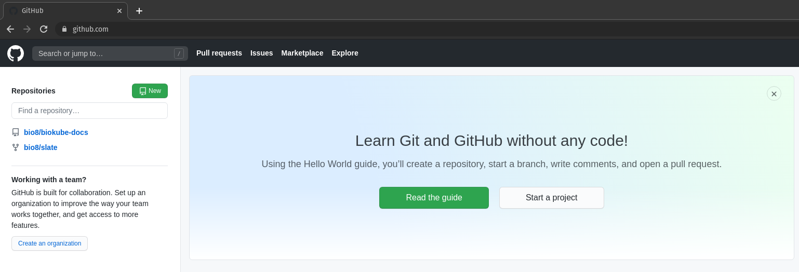

# Biokube Developer Docs

## Setup Docker

### 1\. Install Docker

> 1\. Install Docker

```shell
sudo apt update
sudo apt install apt-transport-https ca-certificates curl software-properties-common
curl -fsSL https://download.docker.com/linux/ubuntu/gpg | sudo apt-key add -
sudo add-apt-repository "deb [arch=amd64] https://download.docker.com/linux/ubuntu focal stable"
sudo apt update
apt-cache policy docker-ce
sudo apt install docker-ce
sudo systemctl status docker
sudo usermod -aG docker ${USER}
docker ps
```

### 2\. Re-login current user and show group membership for current user

> 2\. Re-login current user and show group membership for current user

```shell
su - ${USER}
id -nG
```

### 3\. Install Portainer

Portainer is a Visual Docker container management tool. [more info](https://www.portainer.io/)

> 3\. Install Portainer

```shell
docker volume create portainer_data
docker run -d -p 8000:8000 -p 9000:9000 --name=portainer --restart=always -v /var/run/docker.sock:/var/run/docker.sock -v portainer_data:/data portainer/portainer
```

After successful installation Portainer is served as a docker container at [http://localhost:9000](http://localhost:9000)

login = <code>admin</code><br>
password = <code>the password set on first use</code>

## Setup Nodejs

### 1\. Install NVM

> 1\. Install NVM

```shell
curl https://raw.githubusercontent.com/creationix/nvm/master/install.sh | bash
```

### 2\. Edit ~/.zshrc

> 2\. Edit ~/.zshrc

```shell
nano ~/.zshrc
export NVM_DIR="$HOME/.nvm"
[ -s "$NVM_DIR/nvm.sh" ] && \. "\$NVM_DIR/nvm.sh" # This loads nvm
```

### 3\. Find Available Node.js Versions

> 3\. Find Available Node.js Versions

```shell
nvm ls-remote
```

### 4\. Install selected Node.js versions with NVM

> 4\. Installing selected Node.js versions with NVM

```shell
nvm install v12.18.2
nvm install v14.5.0
```

### 5\. Set Node.js Default version

> 5\. Set Node.js Default version

```shell
nvm list
nvm use v12.18.2
node --version
```

### 6\. Run Application with Specific Version

> 6\. Run Application with Specific Version

```shell
nvm run v12.18.2 app.js
```

### 7\. Remove Unused Node.js Version

> 7\. Remove Unused Node.js Version

```shell
nvm list
nvm uninstall v4.9.1
```

## Setup Yarn

### 1\. Install or update Yarn

> 1\. Install or update Yarn

```shell
curl --compressed -o- -L https://yarnpkg.com/install.sh | bash
```

## Setup GitHub

### 1\. Create a Public/Private RSA keypair

If you created a Public/Private RSA Keypair before it should be located here:<br>
Your personal Private key is stored in a file <code>~/.ssh/id_rsa</code> and should have restricted filesystem permissions <code>chmod 400</code>.<br>
Your personal Public key is stored in a file <code>~/.ssh/id_rsa.pub</code>
Restrict filesystem permissions on your <b>Private</b> key<br>

If you don't have a Public/Private RSA Keypair you can create one using OpenSSH

> 1\. Create a Public/Private RSA keypair

```shell
ssh-keygen -t rsa -b 2048
chmod 400 ~/.ssh/id_rsa
```

### 2\. Copy your public key to GitHub

Login to GitHub and in your GitHub account profile menu click on <b>Settings</b> and then in the left menu on <b>SSH and GPG keys</b>

[](../images/github-add-ssh-key.png 'Click to enlarge')

Paste the contents of your <b>Public</b> key and give your SSH key a title.

[](../images/github-add-ssh-key-new.png 'Click to enlarge')

Click on <code>Add SSH key</code>

### 3\. Create Remote GIT repository on Github

Login to GitHub

[](../images/github-create-new-repository.png 'Click to enlarge')

Click on the <code>New</code> button

[](../images/github-create-new-public-repository.png 'Click to enlarge')

Click on <code>Create repository</code> button

### 4\. Link local existing GIT repository to remote existing GitHub repository

#### 4.1\. GitHub invite Collaborator

In order to be able to commit to a remote GitHub repository, you need to be the creator/owner or a valid collaborator for this repository.
If you manage multiple Github accounts you can still commit and collaborate with one and the same GitHub user account to multiple repositories over multiple GitHub accounts, by inviting the GitHub user account as a collaborator for that repository.<br>
Just login to the GitHub account that hosts the repository you like to collaborate to and invite your own Github user account to collaborate to that repository.
Click on <b>Settings</b> tab.
Click on <b>Manage access</b> menu item.
Click on <code>Invite a collaborator</code> button

[](../images/github-manage-access.png 'Click to enlarge')

An Email will be sent to the mailbox associated with your own GitHub account. Clicking on the <b>accept</b> link in the email will open a consent screen in GitHub where you can accept the invite.

[](../images/github-invite-collaborator-email.png 'Click to enlarge')

[](../images/github-invite-collaborator-accept.png 'Click to enlarge')

#### 4.2\. Change <code>origin</code> of your GIT repository

In case you want to commit to another remote repository than the one you originally cloned from, you need to change the origin of your local GIT repository.
You can do this with this set of <code>git</code> commands. <br>
If <code>origin</code> is not set in the local repo you may skip the command <code>git remote rm origin</code>.

> 4.2\. Change <code>origin</code> of your GIT repository

```shell
git remote show origin
git remote rm origin
git remote add origin git@github.com:bio8/biokube.git
git config master.remote origin
git config master.merge refs/heads/master
git fetch
git branch --set-upstream-to=origin/master master
git pull origin master --allow-unrelated-histories
git push -u origin master
```

## Setup Visual Studio Code

### 1\. Install Visual Studio Code

Download and install Visual Studio Code or Visual Studio Code Insiders (Canary)

[Download Visual Studio Code](https://code.visualstudio.com/insiders/)<br>
[Download Visual Studio Code Insiders](https://code.visualstudio.com/insiders/)

### 2\. Install Visual Studio Code Fonts

#### 2.1\. Install Terminal Nerd Font

Download and install (by double clicking) Nerd Font:

[MesloLGS NF Regular.ttf](https://github.com/romkatv/powerlevel10k-media/raw/master/MesloLGS%20NF%20Regular.ttf)<br>
[MesloLGS NF Bold.ttf](https://github.com/romkatv/powerlevel10k-media/raw/master/MesloLGS%20NF%20Bold.ttf)<br>
[MesloLGS NF Italic.ttf](https://github.com/romkatv/powerlevel10k-media/raw/master/MesloLGS%20NF%20Italic.ttf)<br>
[MesloLGS NF Bold Italic.ttf](https://github.com/romkatv/powerlevel10k-media/raw/master/MesloLGS%20NF%20Bold%20Italic.ttf)

#### 2.2\. Install Fira Code Font

<code>`sudo apt update && sudo apt install fonts-firacode`</code>

> 2.2\. Install Fira Code Font

```shell
sudo apt update && sudo apt install fonts-firacode
```

#### 2.3\. Configure Fonts in settings.json

Open File → Preferences → Settings and click on the icon  to toggle <code>settings.json</code> in code view.

[](../images/vscode-settings-json.png 'Click to enlarge')

> 2.3\. Configure Fonts in settings.json

```json
{
  "terminal.integrated.fontFamily": "MesloLGS NF",
  "editor.fontFamily": "'Fira Code', 'Operator Mono', 'Droid Sans Mono', 'monospace', monospace, 'Droid Sans Fallback'"
}
```

Set <code>"terminal.integrated.fontFamily": "MesloLGS NF"</code><br>
Set <code>"editor.fontFamily": "'Fira Code', 'Operator Mono', 'Droid Sans Mono', 'monospace', monospace, 'Droid Sans Fallback'"</code>

### 3\. Install Visual Studio Code Extensions

Install Your favorite Extensions:

[](../images/vscode-extensions.png 'Click to enlarge')

### 4\. Install Oh My zsh

#### 4.1\. Install Oh My Zsh

> 4.1\. Install Oh My Zsh

```shell
sudo apt install zsh
sh -c "\$(curl -fsSL https://raw.github.com/ohmyzsh/ohmyzsh/master/tools/install.sh)"
```

#### 4.2\. Install Oh My Zsh powerlevel10k theme

> 4.2\. Install Oh My Zsh powerlevel10k theme

```shell
git clone --depth=1 https://github.com/romkatv/powerlevel10k.git ${ZSH_CUSTOM:-$HOME/.oh-my-zsh/custom}/themes/powerlevel10k
```

#### 4.3\. Install zsh autosuggestions

> 4.3\. Install zsh autosuggestions

```shell
git clone https://github.com/zsh-users/zsh-autosuggestions ${ZSH_CUSTOM:-~/.oh-my-zsh/custom}/plugins/zsh-autosuggestions
```

#### 4.4\. Edit ~/.zshrc

> 4.4\. Edit ~/.zshrc

```shell
nano ~/.zshrc
ZSH_THEME="powerlevel10k/powerlevel10k"
plugins=(git zsh-autosuggestions)
```

Now Reboot to load the Fonts we installed.<br>
Now when you open a new terminal session the Oh My Zsh configuration wizard will be launched

#### 4.5\. Run the configuration wizard

You can always re-run the configuration wizard later with the following command:
<code>`p10k configure`</code>

> 4.5\. Run the configuration wizard

```shell
p10k configure
```

#### 4.6\. How to Update powerlevel10k to the latest version

> 4.6\. How to Update powerlevel10k to the latest version

```shell
git -C ${ZSH_CUSTOM:-$HOME/.oh-my-zsh/custom}/themes/powerlevel10k pull
```

#### 4.7\. How to Uninstall powerlevel10k

> 4.7\. How to Uninstall powerlevel10k

```shell
rm -rf -- ${ZSH_CUSTOM:-$HOME/.oh-my-zsh/custom}/themes/powerlevel10k
```

### 5\. Visual Studio Code shortcuts

Delete line: <code>`CTRL + SHIFT + K`</code><br>
Move line up/down: <code>`ALT + UP/DOWN`</code><br>
Multicursor: Search a substring and then click on 1 instance and press <code>`CTRL + SHIFT + L`</code><br>
Open Command Panel: <code>`CTRL + SHIFT + P`</code><br>

## Setup Nx Monorepo Workspace

Biokube is organized as a convenient Nx Monorepo Workspace. This enables a clean professional organized development codebase.

### 1\. Install Nx CLI

> 1\. Install Nx CLI

```shell
sudo npm i -g @nrwl/cli
```

### 2\. Create Nx Biokube Monorepo Workspace

First create an empty Nx Monorepo Workspace named <code>`biokube`</code>. Then we add support for Next.js and Nest.js applications

> 2\. Create Nx Biokube Monorepo Workspace

```shell
npx create-nx-workspace@latest biokube --preset=empty --cli=nx --skipGit=false --npm-scope=scope --nx-cloud=false
yarn add -D @nrwl/nest @nrwl/next
```

### 3\. Create Nx Biokube Applications and Libraries

Nx can manage multiple projects in a single git repository. This is called a monorepo. <br>
The Biokube monorepo consists of multiple projects divided between apps and libs.

apps:

- biokube-api
- biokube-data
- biokube-docs
- biokube-native
- biokube-web

libs:

- cloud
- container
- data
- integration
- service
- types

libs UI:

- web
- native

> 3\. Create Nx Biokube Applications and Libraries

```shell
nx g @nrwl/nest:app biokube-api
nx g @nrwl/nest:app biokube-data
nx g @nrwl/next:app biokube-web --style="styled-components"

nx g @nrwl/node:lib types
nx g @nrwl/node:lib cloud
nx g @nrwl/node:lib container
nx g @nrwl/node:lib data
nx g @nrwl/node:lib integration
nx g @nrwl/node:lib service

nx g @nrwl/next:lib blocks -d ui/web --pascalCaseFiles
nx g @nrwl/next:lib blocks -d ui/native --pascalCaseFiles

nx g @nrwl/next:lib elements -d ui/web --pascalCaseFiles
nx g @nrwl/next:lib elements -d ui/native --pascalCaseFiles

nx g @nrwl/next:component Button -p ui-web-elements -e
nx g @nrwl/next:component Button -p ui-native-elements -e
```

### 4\. Deleting a library

> 4\. Deleting a library

```shell
nx g @nrwl/node:remove service --forceRemove
```

### 5\. Display Dependency Graph

> 5\. Display Dependency Graph

```shell
nx dep-graph
```

### 6\. NX Commands

You can run Nx workspace commands from the Nx Console VS Code extension or from the command line. <br>
These commands are managed, configured and customized under <code>`project.<PROJECT_NAME>.architect`</code> key in <code>`workspace.json`</code> file located in the root of your Nx monorepo workspace.

[](../images/vscode-nx-commands.png 'Click to enlarge')

## Setup K3D

### 1\. Install kubectl

> 1\. Install kubectl

```shell
curl -LO https://storage.googleapis.com/kubernetes-release/release/`curl -s https://storage.googleapis.com/kubernetes-release/release/stable.txt`/bin/linux/amd64/kubectl

chmod +x ./kubectl

sudo mv ./kubectl /usr/local/bin/kubectl

kubectl version --client

kubectl config view --minify --raw
`cat $HOME/.kube/config`
```

#### 1.1\. Setup kubectl autocompletion:

> 1.1\. Setup kubectl autocompletion:

```shell
sudo apt-get install bash-completion

Add the following lines to the beginning of ~/.zshrc
autoload -Uz compinit
compinit

Then run the following commands:
echo 'source <(kubectl completion zsh)' >>~/.zshrc
echo 'alias k=kubectl' >>~/.zshrc
echo 'complete -F \_\_start_kubectl k' >>~/.zshrc

source ~/.zshrc
```

### 2\. Install K3D

> 2\. Install K3D

```shell
curl -s https://raw.githubusercontent.com/rancher/k3d/main/install.sh | bash

k3d version
k3d cluster list
k3d cluster create biokube --api-port 6550 -s 1 -a 3 -p 8080:80@loadbalancer -v /home/pmualaba/Development/bio8/biokube:/src@all
k3d kubeconfig merge biokube --switch-context
kubectl cluster-info
kubectl get nodes
```

Import Docker image from local Docker host to K3D containerd (In order to make the Container Runtime Images available for helm, this command imports a specified Docker image to every node in the specified K3D cluster(s) and is executed behind the scenes using a special purpose k3d-tools container)

k3d image import biokube-docs:latest -c biokube

helm upgrade --install biokube-docs libs/container/helm/charts/biokube-docs --namespace biokube --set app.image=biokube-docs:latest

k3d cluster delete biokube

### 3\. Install K3X

> 3\. Install K3X

```shell
flatpak install flathub com.github.inercia.k3x
flatpak run com.github.inercia.k3x
```

### 4\. Install helm

> 4\. Install helm

```shell
curl -fsSL -o get_helm.sh https://raw.githubusercontent.com/helm/helm/master/scripts/get-helm-3
chmod 700 get_helm.sh
./get_helm.sh
rm get_helm.sh

helm version
helm repo add stable https://kubernetes-charts.storage.googleapis.com/
helm repo update
helm search repo stable
```

### 5\. Common kubernetes commands

1.2.1 Kubernetes Cluster Context
k config get-contexts (show current context)
k config use-context <CONTEXT_NAME> (switch context)
k cluster-info (show current cluster info)
k api-resources (show list of existing API resources)
k api-resources --api-group=apps (show list of existing API resources within a specific api group)
k api-resources --namespaced=true (show list of existing API resources that are namespacable)
k api-resources --api-version=apps/v1beta2 (follow API object version in deprecation warning)
k api-versions (show available API object versions)

1.2.1 Kubernetes API

k explain pods (explain Pod manifest fields)
k explain pods.spec (explain Pod.spec manifest fields)

1.2.2 Kubernetes API Debugging
k proxy & (start a local Proxy server at http://localhost:8001 for debugging)
curl http://localhost:8001/api/v1/namespaces/kube-system/pods (Interact with kubernetes REST Api for debugging, this outputs raw JSON in stead of formatted tables)

k get pods --watch & (Watch for state changes on a specific request)
netstat -plant | grep kubectl (check for an ESTABLISHED TCP connection)
fg (bring back background processvto foreground, now you can CTRL + C this process)

k get pod <POD_NAME> -v 6 (kubectl command with increased verbosity level to disclose all REST API requests executed for this command)

k label pod <POD_NAME>-<pod-template-hash/replicaset-id>-<pod-id> 'pod-template-hash=DEBUG,app=DEBUG' --overwrite (put Pod outside of the selectorscope of the ReplicaSet AND out of the selectorscope of the Service so that the ReplicaSet does not recreate it and so that the Service removes it from its Endpoints list)
k get pods --show-labels

k get events --watch &

k get nodes --watch (watch node status)

k exec -v 6 -it <POD_NAME> -- /bin/sh
ps
exit
k exec -it <POD_NAME> -- /usr/bin/killall <PROCESS_NAME> (Use the process COMMAND you got from running ps inside the container)

Show Environment Variables inside Container

k exec -it <POD_NAME> -- /bin/sh -c "printenv | sort"
k exec -it <POD_NAME> -- env | sort"

Hit Ingress

curl http://<INGRESS_IP>/<PATH> --header 'Host: <HOST.example.com>'
curl https://<INGRESS_HOST>:443 --resolve <INGRESS_HOST>:443:<INGRESS_IP> --insecure --verbose (use --insecure for selfsigned certs)

k run -it --rm curl --restart=Never --image=nbrown/curl -- <SERVICE_NAME or SERVICE_IP>:<SERVICE_PORT>

1.2.2 Kubernetes Resources

k get namespaces
k describe namespaces
k describe pod <POD_NAME>
k describe endpoint <SERVICE_NAME> (show endpoints associated with this service)

k get pods all --all-namespaces -o wide (get all resources across all namespaces)
k get pods all --namespace=default (get all resources inside the default namespace)
k get pods --all-namespaces (get pods across all namespaces)
k get pods --namespace kube-system (get pods inside kube-system namespace, alias -n)
k get pods (get all pods inside the default namespace)

k get pods --show-labels (show pods and the labels associated with these pods)
k get pods --selector tier=prod (select pods with label tier=prod, alias -l)
k get pods -l 'tier=prod,app!=MyWebApp' (eq AND neq)
k get pods -l 'tier in (prod, qa)'
k get pods -l 'tier notin (prod, qa)'
k get pods -L tier,app (show TIER and APP label columns)
k get node -L disk,hardware (show TIER and HARDWARE label columns)

k label pod --all tier=non-prod --overwrite (update label value for label key tier to 'non-prod' on all pods in the default namespace)
k label node c1-node1 disk=local_ssd (label a node)

k delete pods --all --namespace default (delete all pods inside default namespace, be aware that this command is rather useless since kubernetes will try to bring them back because of the deployment definition which contains a replicaset)
k delete delete namespace <NAMESPACE> (delete all resources inside <NAMESPACE>)
k delete pod -l tier=non-prod (delete selection of pods)

k exec -v 6 -it <POD_NAME> -- /bin/sh
k logs <POD_NAME>
k port-forward <POD_NAME>-<pod-template-hash/replicaset-id>-<pod-id> <LOCAL_PORT>:<CONTAINER_PORT> (make sure you use linux non-priviledge port (>1024) as <LOCAL_PORT>)
curl http://localhost:<LOCAL_PORT>

k scale deployment <DEPLOYMENT_NAME> --replicas=2

k get endpoints <SERVICE_NAME>
`PODIP=$(kubectl get endpoints <SERVICE_NAME> -o jsonpath='{.subsets[].addresses[].ip }')`

Kubernetes Cluster DNS Service

<SERVICE_NAME>.<NAMESPACE>.svc.cluster.local
nslookup <SERVICE_NAME>.<NAMESPACE>.svc.cluster.local <kube-dns_CLUSTER-IP>

k delete -f ./<INGRESS_CONTROLLER.yaml>

1.2.3 Kubernetes Helpers

GetServiceIpByServiceName:

SERVICEIP=$(kubectl get service | grep <SERVICE_NAME> | awk '{ print $3 }')
`SERVICEIP=$(kubectl get service <SERVICE_NAME> -o jsonpath='{ .spec.clusterIP }')`

GetFirstPodNameFromDeployment

PODNAME=$(kubectl get pods | grep <DEPLOYMENT_NAME> | awk '{ print $1 }' | head -n 1)

GetSecretValue

`echo $(kubectl get secret <SECRET_NAME> --template={{.data.<KEY_NAME>}} | base64 --decode)`

GetIngressIP

`INGRESSIP=$(kubectl get ingress -o jsonpath='{ .items[].status.loadBalancer.ingress[].ip }')`

k create secret tls tls-secret --key tls.key --cert tls.crt

1.2.4 docker-registry secret

sudo chown $(id -u):$(id -g) ~/.docker/
sudo chown $(id -u):$(id -g) ~/.docker/config.json

k create secret docker-registry docker-hub-login
--docker-server=https://index.docker.io/v1/
--docker-username=<USERNAME>
--docker-password=<PASSWORD>
--docker-email=<EMAIL>

## Setup Biokube Docs

Since every application development project needs some form of public facing documentation, Biokube includes a dedicated Nx app project which does just that.
<code>`biokube-docs`</code> is based on the popular [https://github.com/slatedocs/slate](https://github.com/slatedocs/slate). Several Nx custom run commands are pre-configured already for you. You con run them from terminal inside the root of the monorepo or launch them from NX Console inside VS Code.

### 1\. Create development docker container

To create a local development container for authoring and editing your public facing documentation using Markdown, just run <code>`nx run biokube-docs:develop-docker-image`</code> and when the development image has finished building, run a development container with the following command: <code>`nx run biokube-docs:develop-docker-run`</code>.

Behind the scenes <code>`nx run biokube-docs:develop-docker-run`</code> executes a <code>`docker run`</code> command with a hostmount volume param <code>`-v $(pwd)/../biokube-web/public/docs:/srv/docs/build`</code> that links to an existing empty build folder on the Docker host. This empty build directory will later be used as output directory for static site generation from within the container. (see step 3.)

The documentation project will be served for development at [http://localhost:4567](http://localhost:4567)

Now you can make changes to your documentation content and styles.

Documentation pages are stored as Markdown files located at:

&emsp;&emsp;<b>src/index.html.md</b> <br>
&emsp;&emsp;<b>src/includes/\_\<YOUR_DOCUMENTATION_PAGES>.md</b>

Images for your Documentation pages are stored in:

&emsp;&emsp;<b>src/images</b>

You can edit styling in the following SASS stylesheets:

&emsp;&emsp;<b>src/stylesheets/\_variables.scss</b> <br>
&emsp;&emsp;<b>src/stylesheets/screen.css.scss</b>

Navigate to [http://localhost:4567/](http://localhost:4567/) and Refresh your browser to see the changes.

> 1\. Create docker container image

```shell
nx run biokube-docs:develop-docker-image
docker image list

nx run biokube-docs:develop-docker-run
docker container list
```

### 2\. Create production docker container

To create a stand-alone production container for serving the public facing documentation, first run <code>`nx run biokube-docs:production-docker-image`</code>.
Behind the scenes this command first runs the developer Docker container (see step 1) but with a different hostmount volume param <code>`-v $(pwd)/container/docker/build:/srv/docs/build`</code>. This build directory is used as output directory for the static site generation from within the development container.

Next, a <code>`docker build`</code> command is executed, to persist the static site that was generated (<code>`COPY`</code> from biokube-docs/container/docker/build) into the production Docker image.

Now you can run a production container from this production image locally with the following command <code>`nx run biokube-docs:production-docker-run`</code>

The production documentation container will be served at [http://localhost:3003](http://localhost:3003)

This image can also be used to be deployed in your production kubernetes cluster.

> 2\. Run docker container

```shell
nx run biokube-docs:production-docker-image
docker image list

nx run biokube-docs:production-docker-run
docker container list
```

### 3\. Create production build

If you don't want to run a separate stand-alone container to serve the public facing documentation, you can opt to inject the generated static site into the <code>`biokube-web`</code> container inside <code>`/public/docs`</code> folder. This is done by running <code>`nx run biokube-docs:production-build-inject`</code>

Behind the scenes <code>`nx run biokube-docs:production-build-inject`</code> executes a <code>`docker run`</code> command from the developer container image with a hostmount volume param <code>`-v $(pwd)/../biokube-web/public/docs:/srv/docs/build`</code> that links to <code>`biokube-web/public/docs`</code>. This build directory is used as output directory for static site generation from within the development container.<br>
This results in injecting the static site into <code>`/public/docs`</code> folder inside the <code>`biokube-web`</code> Nx app project.

The generated static assets can also be hosted on your favorite cloud provider.

> 3\. Inject production build

```shell
nx run biokube-docs:production-build-inject
docker container list
```

### 4\. Nx Commands

<code>`develop-docker-image`</code> <br>
&emsp;Creates a docker image named <code>`biokube-docs:v1.0.0-develop`</code> for local development<br>

<code>`develop-docker-run`</code> <br>
&emsp;Runs a docker container from image <code>`biokube-docs:v1.0.0-develop`</code> and serves it at [http://localhost:4567](http://localhost:4567)<br>

<code>`production-docker-image`</code> <br>
&emsp;Creates a docker image named <code>`biokube-docs:v1.0.0-production`</code> for production with static content persisted inside the docker image.<br>

<code>`production-docker-run`</code> <br>
&emsp;Runs a docker container from image <code>`biokube-docs:v1.0.0-production`</code> for production with static content persisted inside the docker image and serves it at [http://localhost:3003](http://localhost:3003).<br>

<code>`production-build-inject`</code> <br>
&emsp;From a running <code>`biokube-docs:v1.0.0-develop`</code> development container builds a static site from src and injects the generated static site in <code>`biokube-web`</code> app inside <code>`/public/docs`</code> folder.<br>

> 4\. Nx Commands

```shell
nx run biokube-docs:develop-docker-image
nx run biokube-docs:develop-docker-run
nx run biokube-docs:production-docker-image
nx run biokube-docs:production-docker-run
nx run biokube-docs:production-build-inject
```

## Setup Biokube API

<code>`biokube-api`</code> is setup as a Nx app inside the Biokube Nx monorepo workspace. It runs as a docker container and consolidates all backend API libraries into a unified stateless scalable API

## Setup Biokube Native

<code>`biokube-native`</code> is setup as a Nx app inside the Biokube Nx monorepo workspace. It contains the directory structure recommended for React Native mobile development. If you want to develop Apple iOS apps you will need to run Biokube on a Mac. If you run Biokube on Linux you will only be able to build Android Apps

### 1\. Enable CPU Virtualization on Linux

Make sure VT or SVM CPU Virtualization is Enabled in BIOS
check KVM support with <code>`egrep -c '(vmx|svm)' /proc/cpuinfo`</code> (An outcome greater than 0 implies that virtualization is supported)

> 1\. Enable CPU Virtualization on Linux

```shell
egrep -c '(vmx|svm)' /proc/cpuinfo

sudo apt install cpu-checker
sudo kvm-ok

sudo apt install -y qemu qemu-kvm libvirt-daemon libvirt-clients bridge-utils virt-manager
sudo systemctl status libvirtd
```

### 2\. Install JAVA 8 JDK

> 2\. Install JAVA 8 JDK

```shell
sudo apt update
sudo apt install openjdk-8-jdk openjdk-8-jre
export JAVA_HOME=/usr/lib/jvm/java-8-openjdk-amd64
```

### 3\. Install Android Studio

[install Android Studio](https://reactnative.dev/docs/environment-setup)

Unpack the contents of the zip archive to <code>`~/Applications/android-studio`</code>

To install Open a console and cd into <code>`~/Applications/android-studio/bin`</code> and type:

<code>./studio.sh</code>

Choose a <code>Custom</code> setup when prompted to select an installation type. Make sure the boxes next to all of the following are checked:

- <code>Android SDK</code>
- <code>Android SDK Platform</code>
- <code>Android Virtual Device</code>

Then, click <code>Next</code> to install all of these components.

### 4\. Install Android SDK

Android Studio installs the latest Android SDK by default. Building a React Native app with native code, however, requires the <code>`Android 10 (Q) SDK`</code> in particular.

The SDK Manager can be found within the Android Studio <code>`Preferences`</code> dialog, under <code>Appearance & Behavior → System Settings → Android SDK</code>

Select the <code>`SDK Platforms`</code> tab from within the SDK Manager, then check the box next to <code>`Show Package Details`</code> in the bottom right corner. Look for and expand the <code>Android 10 (Q)</code> entry, then make sure the following items are checked:

- <code>Android SDK Platform 29</code>
- <code>Intel x86 Atom_64 System Image</code>
- <code>Google APIs Intel x86 Atom System Image</code>

Next, select the <code>`SDK Tools`</code> tab and check the box next to <code>`Show Package Details`</code> here as well. Look for and expand the <code>`Android SDK Build-Tools`</code> entry, then make sure that <code>`29.0.2`</code> is selected.

Finally, click <code>Apply</code> to download and install the Android SDK and related build tools.

### 5\. Configure the ANDROID_HOME environment variable

> 5\. Configure the ANDROID_HOME environment variable

```shell
nano ~/.zhsrc

`export ANDROID_HOME=$HOME/Android/Sdk`
`export PATH=$PATH:$ANDROID_HOME/emulator`
`export PATH=$PATH:$ANDROID_HOME/tools`
`export PATH=$PATH:$ANDROID_HOME/tools/bin`
`export PATH=$PATH:$ANDROID_HOME/platform-tools`

`source $HOME/.zhsrc`
```

Verify that <code>`ANDROID_HOME`</code> has been added to your path by running

```shell
`echo $PATH`
```

Please make sure you use the correct Android SDK path. You can find the actual location of the SDK in the Android Studio <code>`Preferences`</code> dialog, under <code>`Appearance & Behavior → System Settings → Android SDK`</code>

### 6\. Install Watchman

Download [Watchman](https://github.com/facebook/watchman/releases/latest)

Unzip and navigate into the unzipped folder

Then run the following commands:

<code>sudo mkdir -p /usr/local/{bin,lib} /usr/local/var/run/watchman</code>
<code>sudo cp bin/_ /usr/local/bin</code><br>
<code>sudo cp lib/_ /usr/local/lib</code><br>
<code>sudo chmod 755 /usr/local/bin/watchman</code><br>
<code>sudo chmod 2777 /usr/local/var/run/watchman</code><br>

> 6\. Install Watchman

```shell
sudo mkdir -p /usr/local/{bin,lib} /usr/local/var/run/watchman
sudo cp bin/_ /usr/local/bin
sudo cp lib/_ /usr/local/lib
sudo chmod 755 /usr/local/bin/watchman
sudo chmod 2777 /usr/local/var/run/watchman
```

### 7\. Run Android Studio:

<code>`cd ~/Applications/android-studio/bin && ./studio.sh`</code>

> 7\. Run Android Studio:

```shell
cd ~/Applications/android-studio/bin && ./studio.sh
```

### 8\. Setup NX app project for React-Native:

> 8\. Setup NX app project for React-Native:

```shell
sudo npm i -g @react-native-community/cli@next

yarn add --dev @jbuijgers/nx-react-native
nx g @jbuijgers/nx-react-native:app biokube-native io.biokube.app
chmod a+x apps/biokube-native/android/gradlew

nx serve biokube-native
nx build biokube-native
```

### 9\. Run on Android Simulator

Open <code>`AVD Manager`</code> from Android Studio (<code>AVD Manager</code> icon)<br>
Open and Run (<code>Run</code> icon) Android Project (<code>`apps/biokube-app/android`</code> folder) from Android Studio

### 10\. How to delete Nx React Native project

<code>`nx g @jbuijgers/nx-react-native:remove biokube-native`</code>

> 10\. How to delete Nx React Native project

```shell
nx g @jbuijgers/nx-react-native:remove biokube-native
```
